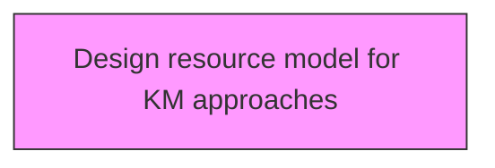
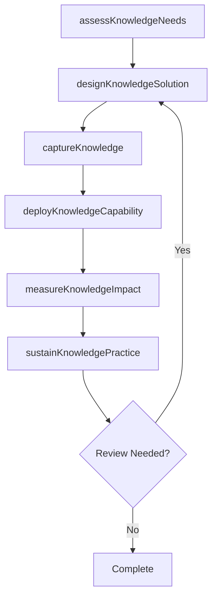

# Design resource model for KM approaches

> Business-as-Code definition for design resource model for km approaches. Models the process of creating a model to describe resources and approaches to organization's knowledge management.

## Overview

Creating a model to describe resources and approaches to organization's knowledge management. Establish standards and guidelines to be followed.

## Process Hierarchy



## GraphDL

```yaml
design:
  object: Resource Model For KM Approaches
  actor: KnowledgeManager
  result: resourceModelForKmApproachesResult
```

## Actions

| Action | Description |
|--------|-------------|
| assessKnowledgeNeeds | Evaluate knowledge requirements for resource model for km approaches |
| designKnowledgeSolution | Create the approach and design for resource model for km approaches |
| captureKnowledge | Collect and codify knowledge assets for resource model for km approaches |
| deployKnowledgeCapability | Roll out knowledge capabilities for resource model for km approaches |
| measureKnowledgeImpact | Assess the value and impact of resource model for km approaches |
| sustainKnowledgePractice | Maintain and evolve resource model for km approaches over time |

## Events

| Event | Description |
|-------|-------------|
| knowledgeNeedsAssessed | Knowledge requirements evaluated |
| knowledgeSolutionDesigned | Knowledge management solution approach created |
| knowledgeCaptured | Knowledge assets collected and codified |
| knowledgeCapabilityDeployed | Knowledge capabilities rolled out |
| knowledgeImpactMeasured | Value and impact of knowledge initiative assessed |
| knowledgePracticeSustained | Knowledge practices maintained and evolved |

## Searches

| Search | Description |
|--------|-------------|
| findResourceModelForKmApproaches | Retrieve resource model for km approaches records filtered by status, date, or scope |
| getResourceModelForKmApproachesDetails | Get detailed information for a specific resource model for km approaches record |
| listResourceModelForKmApproachesHistory | Query the history of changes and updates to resource model for km approaches |
| getActiveItems | List currently active items related to resource model for km approaches |

## Process Flow



## RACI Matrix

| Activity | Responsible | Accountable | Consulted | Informed |
|----------|-------------|-------------|-----------|----------|
| assessKnowledgeNeeds | KnowledgeManager | KMStrategist | BusinessUnitLeads | Stakeholders |
| designKnowledgeSolution | ContentCurator | KnowledgeManager | SubjectMatterExperts | Stakeholders |
| captureKnowledge | KMStrategist | ChiefKnowledgeOfficer | ITArchitecture | Stakeholders |
| deployKnowledgeCapability | KnowledgeManager | KMStrategist | LearningDevelopment | Stakeholders |

## Related Processes

| Process | Relationship |
|---------|-------------|
| 13.5.1 Develop KM strategy | Upstream - strategy guides KM capability development |
| 13.5.2 Assess KM capabilities | Parallel - assessment informs capability design |
| 13.5.3 Design and implement KM capabilities | Downstream - capabilities are designed and deployed |

## Related Departments

| Department | Role |
|-----------|------|
| Knowledge Management | Primary owner of KM strategy and operations |
| IT | Provides KM platforms and technology infrastructure |
| Human Resources | Integrates KM with learning and development programs |
| Operations | Contributes and consumes operational knowledge assets |

## Related Occupations

| Occupation | Involvement |
|-----------|-------------|
| Knowledge Manager | Leads KM strategy and program delivery |
| KM Strategist | Designs KM approaches and governance models |
| Content Curator | Manages knowledge repositories and content quality |

## KPIs

| KPI | Description | Unit |
|-----|-------------|------|
| Knowledge Reuse Rate | Frequency of knowledge asset reuse across the organization | % |
| Knowledge Capture Rate | Percentage of critical knowledge formally captured | % |
| Time to Find Knowledge | Average time for employees to locate needed knowledge | Minutes |
| KM Engagement Rate | Percentage of employees actively contributing to KM | % |

## Usage

```typescript
import { designResourceModelForKmApproaches } from '@headlessly/design-resource-model-for-km-approaches'

const client = designResourceModelForKmApproaches()

// Evaluate knowledge requirements for resource model for km approaches
const result = await client.assessKnowledgeNeeds({
  scope: 'enterprise',
  period: 'Q1-2025'
})

// Create the approach and design for resource model for km approaches
const assessment = await client.designKnowledgeSolution({
  resultId: result.id,
  criteria: 'standard'
})

// Collect and codify knowledge assets for resource model for km approaches
await client.captureKnowledge({
  resultId: result.id,
  format: 'detailed',
  recipients: ['stakeholders']
})
```
