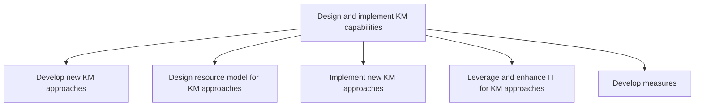
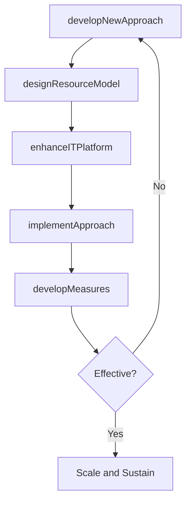

# Design and implement KM capabilities

> Business-as-Code definition for KM capability design and implementation. Models the development of new KM approaches, resource modeling, technology enablement, deployment, and measurement of knowledge management systems.

## Overview

Creating knowledge bases and other repositories to preserve and develop company expertise, and to train new employees.

## Process Hierarchy



## GraphDL

```yaml
design:
  object: And Implement KM Capabilities
  actor: KMArchitect
  result: KMPlatformDeployment
```

## Actions

| Action | Description |
|--------|-------------|
| developNewApproach | Design new KM policies, procedures, and frameworks to address identified gaps |
| designResourceModel | Create the staffing and resource allocation model for KM operations |
| implementApproach | Deploy new KM approaches including tools, processes, and training |
| enhanceITPlatform | Leverage and integrate technology platforms to support KM capabilities |
| developMeasures | Create metrics for evaluating the effectiveness of new KM capabilities |

## Events

| Event | Description |
|-------|-------------|
| newApproachDeveloped | New KM approach designed and documented |
| resourceModelDesigned | KM resource allocation model approved |
| approachImplemented | New KM approach deployed to target user groups |
| itPlatformEnhanced | Technology enhancements deployed to support KM |
| measuresDeveloped | KM effectiveness metrics defined and baselined |

## Searches

| Search | Description |
|--------|-------------|
| findKMApproaches | List KM approaches by status, domain, or implementation date |
| getResourceModel | Retrieve the KM resource allocation model |
| getKMPlatformStatus | Retrieve deployment status of KM technology platforms |
| getKMEffectivenessMetrics | Retrieve metrics measuring KM capability effectiveness |

## Process Flow



## RACI Matrix

| Activity | Responsible | Accountable | Consulted | Informed |
|----------|-------------|-------------|-----------|----------|
| developNewApproach | KMArchitect | KMDirector | BusinessUnitLeads | CKO |
| designResourceModel | KMDirector | CKO | HR | Finance |
| enhanceITPlatform | ITArchitect | CIO | KMDirector | Operations |
| developMeasures | KMAnalyst | KMDirector | Analytics | Executive |

## Sub-Processes

| ID | Name | Description |
|----|------|-------------|
| 13.5.3.1 | Develop new KM approaches | Designing new policies, procedures, and guidelines to support knowledge management. |
| 13.5.3.2 | Design resource model for KM approaches | Creating a model to describe resources and approaches to organization's knowledge management. Establ |
| 13.5.3.3 | Implement new KM approaches | Implementing new policies, procedures, and guidelines to support knowledge management. |
| 13.5.3.4 | Leverage and enhance IT for KM approaches | Using existing technologies to improve organization's knowledge management processes. Research avail |
| 13.5.3.5 | Develop measures | Creating metrics that can be used to systematically describe KM approaches and capabilities. Choose  |

## Related Processes

| Process | Relationship |
|---------|-------------|
| 13.5.2 Assess KM capabilities | Upstream - capability gaps drive design priorities |
| 13.5.4 Evolve and sustain KM capabilities | Downstream - deployed capabilities transition to sustainment |
| 13.5.1 Develop KM strategy | Upstream - strategy defines design requirements |

## Related Departments

| Department | Role |
|-----------|------|
| Knowledge Management | Primary owner of capability design and deployment |
| IT | Builds and integrates KM technology platforms |
| Human Resources | Supports KM role staffing and training |
| Operations | Key consumer of deployed KM capabilities |

## Related Occupations

| Occupation | Involvement |
|-----------|-------------|
| KM Architect | Designs new approaches and repository structures |
| IT Architect | Builds technology platform for KM delivery |
| KM Analyst | Develops effectiveness metrics |

## KPIs

| KPI | Description | Unit |
|-----|-------------|------|
| Deployment Timeliness | Percentage of KM capabilities deployed on schedule | % |
| User Adoption Rate | Percentage of target users actively using deployed KM tools | % |
| Platform Availability | Uptime of KM technology platforms | % |
| Capability Effectiveness Score | Composite score measuring impact of new KM capabilities | Score (1-10) |

## Usage

```typescript
import { designAndImplementKMCapabilities } from '@headlessly/design-and-implement-km-capabilities'

const kmImpl = designAndImplementKMCapabilities()

// Develop a new KM approach for engineering best practices
const approach = await kmImpl.developNewApproach({
  domain: 'engineering-best-practices',
  type: 'community-of-practice',
  targetUsers: ['software-engineers', 'architects', 'tech-leads']
})

// Implement the new approach
const deployment = await kmImpl.implementApproach({
  approachId: approach.id,
  rolloutPhases: ['pilot', 'department', 'enterprise'],
  pilotGroup: 'platform-engineering'
})
```
