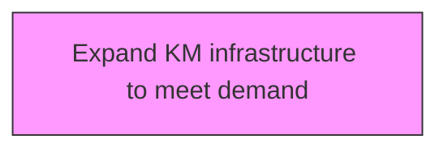
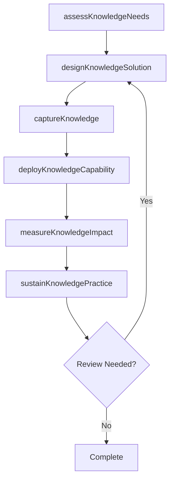

# Expand KM infrastructure to meet demand

> Business-as-Code definition for expand km infrastructure to meet demand. Models the process of augmenting available resources to better leverage the offerings of the organization to serve existing clients and to expand the client base.

## Overview

Augmenting available resources to better leverage the offerings of the organization to serve existing clients and to expand the client base.

## Process Hierarchy



## GraphDL

```yaml
expand:
  object: KM Infrastructure To Meet Demand
  actor: KnowledgeManager
  result: kmInfrastructureToMeetDemandResult
```

## Actions

| Action | Description |
|--------|-------------|
| assessKnowledgeNeeds | Evaluate knowledge requirements for km infrastructure to meet demand |
| designKnowledgeSolution | Create the approach and design for km infrastructure to meet demand |
| captureKnowledge | Collect and codify knowledge assets for km infrastructure to meet demand |
| deployKnowledgeCapability | Roll out knowledge capabilities for km infrastructure to meet demand |
| measureKnowledgeImpact | Assess the value and impact of km infrastructure to meet demand |
| sustainKnowledgePractice | Maintain and evolve km infrastructure to meet demand over time |

## Events

| Event | Description |
|-------|-------------|
| knowledgeNeedsAssessed | Knowledge requirements evaluated |
| knowledgeSolutionDesigned | Knowledge management solution approach created |
| knowledgeCaptured | Knowledge assets collected and codified |
| knowledgeCapabilityDeployed | Knowledge capabilities rolled out |
| knowledgeImpactMeasured | Value and impact of knowledge initiative assessed |
| knowledgePracticeSustained | Knowledge practices maintained and evolved |

## Searches

| Search | Description |
|--------|-------------|
| findKmInfrastructureToMeetDemand | Retrieve km infrastructure to meet demand records filtered by status, date, or scope |
| getKmInfrastructureToMeetDemandDetails | Get detailed information for a specific km infrastructure to meet demand record |
| listKmInfrastructureToMeetDemandHistory | Query the history of changes and updates to km infrastructure to meet demand |
| getActiveItems | List currently active items related to km infrastructure to meet demand |

## Process Flow



## RACI Matrix

| Activity | Responsible | Accountable | Consulted | Informed |
|----------|-------------|-------------|-----------|----------|
| assessKnowledgeNeeds | KnowledgeManager | KMStrategist | BusinessUnitLeads | Stakeholders |
| designKnowledgeSolution | ContentCurator | KnowledgeManager | SubjectMatterExperts | Stakeholders |
| captureKnowledge | KMStrategist | ChiefKnowledgeOfficer | ITArchitecture | Stakeholders |
| deployKnowledgeCapability | KnowledgeManager | KMStrategist | LearningDevelopment | Stakeholders |

## Related Processes

| Process | Relationship |
|---------|-------------|
| 13.5.1 Develop KM strategy | Upstream - strategy guides KM capability development |
| 13.5.2 Assess KM capabilities | Parallel - assessment informs capability design |
| 13.5.3 Design and implement KM capabilities | Downstream - capabilities are designed and deployed |

## Related Departments

| Department | Role |
|-----------|------|
| Knowledge Management | Primary owner of KM strategy and operations |
| IT | Provides KM platforms and technology infrastructure |
| Human Resources | Integrates KM with learning and development programs |
| Operations | Contributes and consumes operational knowledge assets |

## Related Occupations

| Occupation | Involvement |
|-----------|-------------|
| Knowledge Manager | Leads KM strategy and program delivery |
| KM Strategist | Designs KM approaches and governance models |
| Content Curator | Manages knowledge repositories and content quality |

## KPIs

| KPI | Description | Unit |
|-----|-------------|------|
| Knowledge Reuse Rate | Frequency of knowledge asset reuse across the organization | % |
| Knowledge Capture Rate | Percentage of critical knowledge formally captured | % |
| Time to Find Knowledge | Average time for employees to locate needed knowledge | Minutes |
| KM Engagement Rate | Percentage of employees actively contributing to KM | % |

## Usage

```typescript
import { expandKmInfrastructureToMeetDemand } from '@headlessly/expand-km-infrastructure-to-meet-demand'

const client = expandKmInfrastructureToMeetDemand()

// Evaluate knowledge requirements for km infrastructure to meet demand
const result = await client.assessKnowledgeNeeds({
  scope: 'enterprise',
  period: 'Q1-2025'
})

// Create the approach and design for km infrastructure to meet demand
const assessment = await client.designKnowledgeSolution({
  resultId: result.id,
  criteria: 'standard'
})

// Collect and codify knowledge assets for km infrastructure to meet demand
await client.captureKnowledge({
  resultId: result.id,
  format: 'detailed',
  recipients: ['stakeholders']
})
```
