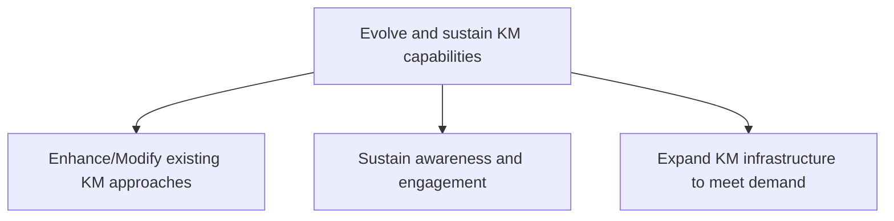
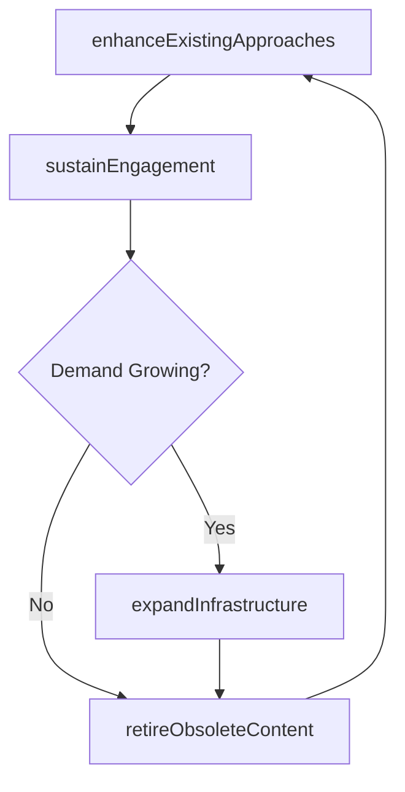

# Evolve and sustain KM capabilities

> Business-as-Code definition for KM capability evolution and sustainment. Models the enhancement of existing KM approaches, ongoing user awareness and engagement, and infrastructure scaling to meet growing demand.

## Overview

Developing resources for improved knowledge management and knowledge engineering.

## Process Hierarchy



## GraphDL

```yaml
evolve:
  object: And Sustain KM Capabilities
  actor: KMDirector
  result: KMEvolutionReport
```

## Actions

| Action | Description |
|--------|-------------|
| enhanceExistingApproaches | Refine and update KM approaches based on feedback and performance data |
| sustainEngagement | Promote KM awareness and encourage ongoing knowledge contribution |
| expandInfrastructure | Scale KM platforms and resources to meet increasing demand |
| retireObsoleteContent | Archive or remove outdated knowledge assets to maintain quality |

## Events

| Event | Description |
|-------|-------------|
| existingApproachesEnhanced | KM approaches updated based on evaluation findings |
| engagementSustained | KM awareness and contribution campaigns executed |
| infrastructureExpanded | KM platforms scaled to accommodate growing usage |
| obsoleteContentRetired | Outdated knowledge assets archived or removed |

## Searches

| Search | Description |
|--------|-------------|
| getEngagementMetrics | Retrieve user engagement and contribution rates for KM platforms |
| findContentForRetirement | List knowledge assets exceeding their review date |
| getInfrastructureCapacity | Retrieve current KM platform utilization and capacity metrics |

## Process Flow



## RACI Matrix

| Activity | Responsible | Accountable | Consulted | Informed |
|----------|-------------|-------------|-----------|----------|
| enhanceExistingApproaches | KMArchitect | KMDirector | BusinessUnitLeads | CKO |
| sustainEngagement | KMCoordinator | KMDirector | Communications | AllEmployees |
| expandInfrastructure | ITArchitect | CIO | KMDirector | Finance |

## Sub-Processes

| ID | Name | Description |
|----|------|-------------|
| 13.5.4.1 | Enhance/Modify existing KM approaches | Leveraging KM evaluations and identified gap to enhance existing approaches. |
| 13.5.4.2 | Sustain awareness and engagement | Developing awareness about available knowledge bases and promoting their use to maximize their impac |
| 13.5.4.3 | Expand KM infrastructure to meet demand | Augmenting available resources to better leverage the offerings of the organization to serve existin |

## Related Processes

| Process | Relationship |
|---------|-------------|
| 13.5.3 Design and implement KM capabilities | Upstream - deployed capabilities transition to sustainment |
| 13.5.2 Assess KM capabilities | Parallel - ongoing assessments inform enhancement priorities |

## Related Departments

| Department | Role |
|-----------|------|
| Knowledge Management | Primary owner of KM evolution and sustainment |
| IT | Scales and maintains KM technology platforms |
| Communications | Supports ongoing engagement and awareness campaigns |

## Related Occupations

| Occupation | Involvement |
|-----------|-------------|
| KM Director | Governs evolution strategy and resource allocation |
| KM Coordinator | Drives engagement campaigns and content curation |
| IT Operations Engineer | Maintains and scales KM platform infrastructure |

## KPIs

| KPI | Description | Unit |
|-----|-------------|------|
| Active User Growth | Month-over-month growth in active KM platform users | % |
| Content Freshness | Percentage of knowledge assets updated within their review cycle | % |
| Infrastructure Uptime | KM platform availability and reliability | % |

## Usage

```typescript
import { evolveAndSustainKMCapabilities } from '@headlessly/evolve-and-sustain-km-capabilities'

const sustain = evolveAndSustainKMCapabilities()

// Enhance an existing KM approach based on feedback
const enhanced = await sustain.enhanceExistingApproaches({
  approachId: 'KM-community-of-practice-eng',
  improvements: ['search-relevance-tuning', 'mobile-access', 'gamification'],
  feedbackSource: 'quarterly-survey-Q4'
})

// Sustain engagement across the organization
const engagement = await sustain.sustainEngagement({
  campaign: 'knowledge-sharing-month',
  channels: ['intranet', 'email', 'slack'],
  incentives: ['recognition-badges', 'contribution-leaderboard']
})
```
