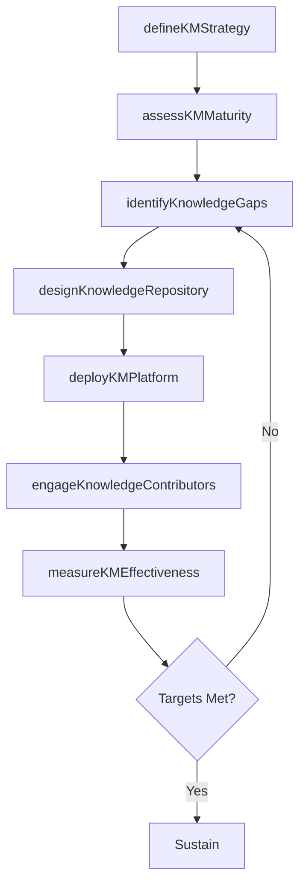

# Develop and manage enterprise-wide knowledge management (KM) capability

> Business-as-Code definition for enterprise knowledge management capability. Models the full KM lifecycle from strategy development and maturity assessment through repository design, implementation, and continuous evolution.

## Overview

Creating and administering the capability of the organization's knowledge management function. Develop a strategy for knowledge management. Assess capabilities of the knowledge management function.

## Process Hierarchy

```mermaid
graph TD
    A[Develop and manage enterprise-wide knowledge management (KM) capability]
    A --> B[Develop KM strategy]
    A --> C[Assess KM capabilities]
    A --> D[Design and implement KM capabilities]
    A --> E[Evolve and sustain KM capabilities]
```

## GraphDL

```yaml
develop:
  object: And Manage Enterprise-wide Knowledge Management (KM) Capability
  actor: KnowledgeManagementDirector
  result: KMCapabilityAssessment
```

## Actions

| Action | Description |
|--------|-------------|
| defineKMStrategy | Establish governance model, funding approach, and KM methodology |
| assessKMMaturity | Evaluate the maturity level of existing KM initiatives and tools |
| identifyKnowledgeGaps | Detect gaps between current knowledge assets and organizational needs |
| designKnowledgeRepository | Architect knowledge bases, taxonomies, and search capabilities |
| deployKMPlatform | Implement knowledge management tools and integrate with IT systems |
| engageKnowledgeContributors | Build awareness and incentivize employees to capture and share knowledge |
| measureKMEffectiveness | Track utilization, contribution rates, and business impact of KM |

## Events

| Event | Description |
|-------|-------------|
| kmStrategyDefined | Knowledge management strategy and governance model approved |
| kmMaturityAssessed | Maturity assessment completed across all business units |
| knowledgeGapsIdentified | Gap analysis documented with prioritized remediation actions |
| knowledgeRepositoryDesigned | Repository architecture and taxonomy finalized |
| kmPlatformDeployed | Knowledge management tools deployed to target user groups |
| knowledgeContributorsEngaged | Contributor onboarding and incentive program launched |
| kmEffectivenessMeasured | KM performance report generated with utilization and impact data |

## Searches

| Search | Description |
|--------|-------------|
| findKnowledgeAssets | Search knowledge repositories by topic, author, or business unit |
| getKMMaturityScores | Retrieve KM maturity scores by department or initiative |
| getContributionMetrics | Get knowledge contribution and reuse statistics |
| findKnowledgeGaps | List documented knowledge gaps by priority and domain |

## Process Flow



## RACI Matrix

| Activity | Responsible | Accountable | Consulted | Informed |
|----------|-------------|-------------|-----------|----------|
| defineKMStrategy | KMDirector | CKO | IT | ExecutiveLeadership |
| assessKMMaturity | KMAnalyst | KMDirector | BusinessUnitLeads | HR |
| deployKMPlatform | ITArchitect | CIO | KMDirector | AllEmployees |
| engageKnowledgeContributors | KMCoordinator | KMDirector | Communications | Managers |
| measureKMEffectiveness | KMAnalyst | KMDirector | Finance | Board |

## Sub-Processes

| ID | Name | Description |
|----|------|-------------|
| 13.5.1 | Develop KM strategy | Creating a plan for managing the organization's knowledge base. Determine what kind of specialized k |
| 13.5.2 | Assess KM capabilities | Assessing the maturity of the existing initiatives in knowledge management, and evaluating existing  |
| 13.5.3 | Design and implement KM capabilities | Creating knowledge bases and other repositories to preserve and develop company expertise, and to tr |
| 13.5.4 | Evolve and sustain KM capabilities | Developing resources for improved knowledge management and knowledge engineering. |

## Related Processes

| Process | Relationship |
|---------|-------------|
| 13.4 Manage change | Parallel - KM supports change adoption through knowledge transfer |
| 13.1 Manage business processes | Upstream - documented processes feed the knowledge base |
| 13.6 Measure and benchmark | Parallel - performance data enriches organizational knowledge |
| 7.3 Manage information technology | Enabling - IT infrastructure underpins KM platforms |

## Related Departments

| Department | Role |
|-----------|------|
| Knowledge Management | Primary owner of KM strategy, governance, and operations |
| Information Technology | Provides platforms, integration, and infrastructure for KM tools |
| Human Resources | Supports knowledge-sharing culture and learning programs |
| Communications | Promotes KM awareness and engagement campaigns |
| Operations | Key consumer and contributor of operational knowledge |

## Related Occupations

| Occupation | Involvement |
|-----------|-------------|
| Knowledge Manager | Leads KM strategy and coordinates enterprise initiatives |
| Knowledge Engineer | Designs taxonomies, ontologies, and repository architectures |
| Information Architect | Structures content and metadata for searchability |
| Organizational Learning Specialist | Connects KM to learning and development programs |

## KPIs

| KPI | Description | Unit |
|-----|-------------|------|
| Knowledge Reuse Rate | Percentage of documented knowledge assets reused across projects | % |
| Contribution Rate | Number of new knowledge articles contributed per employee per quarter | Count |
| Search Success Rate | Percentage of knowledge searches that return relevant results | % |
| KM Maturity Score | Composite maturity rating across KM dimensions | Score (1-5) |
| Time to Knowledge | Average time for employees to find needed information | Minutes |

## Usage

```typescript
import { developAndManageKMCapability } from '@headlessly/develop-and-manage-enterprise-wide-knowledge-management-km-capability'

const km = developAndManageKMCapability()

// Assess KM maturity across departments
const maturity = await km.assessKMMaturity({
  scope: 'enterprise',
  departments: ['engineering', 'sales', 'operations'],
  framework: 'APQC-KM-Maturity'
})

// Deploy a new knowledge repository
const repo = await km.deployKMPlatform({
  name: 'engineering-best-practices',
  taxonomy: ['design-patterns', 'testing', 'deployment'],
  accessPolicy: 'department-wide'
})
```
