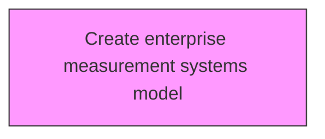
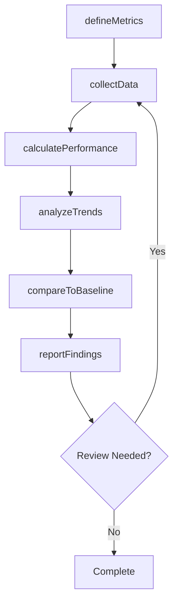

# Create enterprise measurement systems model

> Business-as-Code definition for create enterprise measurement systems model. Models the process of developing a model for organization's management systems.

## Overview

Developing a model for organization's management systems. Develop a high-level measurement system to track performance across the enterprise or in specific functions or business units. Determine which processes to measure, which measures to use, how often to measure, and measurement targets. Review strategic decisions about how to best measure an organization.

## Process Hierarchy



## GraphDL

```yaml
create:
  object: Enterprise Measurement Systems Model
  actor: PerformanceAnalyst
  result: enterpriseMeasurementSystemsModelResult
```

## Actions

| Action | Description |
|--------|-------------|
| defineMetrics | Establish measurement criteria and indicators for enterprise measurement systems model |
| collectData | Gather performance data for enterprise measurement systems model |
| calculatePerformance | Compute performance measures for enterprise measurement systems model |
| analyzeTrends | Identify patterns and trends in enterprise measurement systems model data |
| compareToBaseline | Benchmark enterprise measurement systems model against established targets |
| reportFindings | Generate and distribute enterprise measurement systems model performance reports |

## Events

| Event | Description |
|-------|-------------|
| metricsDefined | Measurement criteria and indicators established |
| dataCollected | Performance data gathered |
| performanceCalculated | Performance measures computed |
| trendsAnalyzed | Performance trends analyzed |
| baselineCompared | Performance benchmarked against established targets |
| findingsReported | Performance findings reported |

## Searches

| Search | Description |
|--------|-------------|
| findEnterpriseMeasurementSystemsModel | Retrieve enterprise measurement systems model records filtered by status, date, or scope |
| getEnterpriseMeasurementSystemsModelDetails | Get detailed information for a specific enterprise measurement systems model record |
| listEnterpriseMeasurementSystemsModelHistory | Query the history of changes and updates to enterprise measurement systems model |
| getActiveItems | List currently active items related to enterprise measurement systems model |

## Process Flow



## RACI Matrix

| Activity | Responsible | Accountable | Consulted | Informed |
|----------|-------------|-------------|-----------|----------|
| defineMetrics | PerformanceAnalyst | MetricsManager | ProcessOwners | Stakeholders |
| collectData | BenchmarkingLead | MetricsManager | Finance | Stakeholders |
| calculatePerformance | MetricsManager | VPStrategy | Operations | Stakeholders |
| analyzeTrends | PerformanceAnalyst | BenchmarkingLead | QualityManagement | Stakeholders |

## Related Processes

| Process | Relationship |
|---------|-------------|
| 13.6.1 Create and manage organizational performance strategy | Upstream - strategy drives measurement approach |
| 13.6.2 Benchmark performance | Parallel - benchmarking provides comparison data |
| 13.6.3 Evaluate process performance | Downstream - process metrics feed evaluation |

## Related Departments

| Department | Role |
|-----------|------|
| Strategy | Sets performance targets aligned with strategic goals |
| Operations | Provides operational performance data and implements improvements |
| Finance | Contributes financial metrics and cost analysis |
| Quality | Integrates quality metrics into performance measurement |

## Related Occupations

| Occupation | Involvement |
|-----------|-------------|
| Performance Analyst | Collects and analyzes performance data |
| Benchmarking Lead | Conducts internal and external benchmarking studies |
| Business Intelligence Analyst | Develops dashboards and performance reports |

## KPIs

| KPI | Description | Unit |
|-----|-------------|------|
| Metric Coverage | Percentage of key processes with defined performance metrics | % |
| Data Collection Timeliness | Percentage of performance data collected on schedule | % |
| Benchmark Gap | Average performance gap versus industry benchmarks | % |
| Improvement Action Completion | Percentage of improvement actions completed on time | % |

## Usage

```typescript
import { createEnterpriseMeasurementSystemsModel } from '@headlessly/create-enterprise-measurement-systems-model'

const client = createEnterpriseMeasurementSystemsModel()

// Establish measurement criteria and indicators for enterprise measurement systems model
const result = await client.defineMetrics({
  scope: 'enterprise',
  period: 'Q1-2025'
})

// Gather performance data for enterprise measurement systems model
const assessment = await client.collectData({
  resultId: result.id,
  criteria: 'standard'
})

// Compute performance measures for enterprise measurement systems model
await client.calculatePerformance({
  resultId: result.id,
  format: 'detailed',
  recipients: ['stakeholders']
})
```
