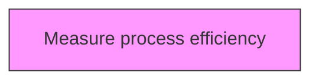
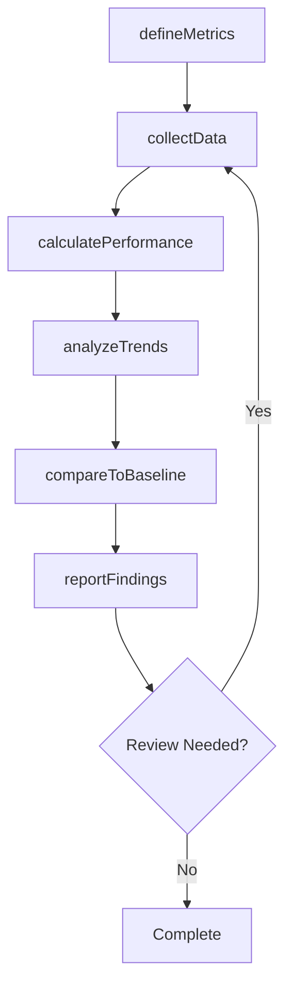

# Measure process efficiency

> Business-as-Code definition for measure process efficiency. Models the process of evaluating the efficiency of the organization's processes.

## Overview

Evaluating the efficiency of the organization's processes. Adapt evaluation to the activities and business components being measured. (Unlike process Measure staff productivity [11078], process Measures outcomes [11076] [e.g., how much of X is produced within X time period].) Measure a manufacturing process, for example, according to number of units produced per FTE or number of "high quality" units produced.

## Process Hierarchy



## GraphDL

```yaml
measure:
  object: Process Efficiency
  actor: PerformanceAnalyst
  result: processEfficiencyResult
```

## Actions

| Action | Description |
|--------|-------------|
| defineMetrics | Establish measurement criteria and indicators for process efficiency |
| collectData | Gather performance data for process efficiency |
| calculatePerformance | Compute performance measures for process efficiency |
| analyzeTrends | Identify patterns and trends in process efficiency data |
| compareToBaseline | Benchmark process efficiency against established targets |
| reportFindings | Generate and distribute process efficiency performance reports |

## Events

| Event | Description |
|-------|-------------|
| metricsDefined | Measurement criteria and indicators established |
| dataCollected | Performance data gathered |
| performanceCalculated | Performance measures computed |
| trendsAnalyzed | Performance trends analyzed |
| baselineCompared | Performance benchmarked against established targets |
| findingsReported | Performance findings reported |

## Searches

| Search | Description |
|--------|-------------|
| findProcessEfficiency | Retrieve process efficiency records filtered by status, date, or scope |
| getProcessEfficiencyDetails | Get detailed information for a specific process efficiency record |
| listProcessEfficiencyHistory | Query the history of changes and updates to process efficiency |
| getActiveItems | List currently active items related to process efficiency |

## Process Flow



## RACI Matrix

| Activity | Responsible | Accountable | Consulted | Informed |
|----------|-------------|-------------|-----------|----------|
| defineMetrics | PerformanceAnalyst | MetricsManager | ProcessOwners | Stakeholders |
| collectData | BenchmarkingLead | MetricsManager | Finance | Stakeholders |
| calculatePerformance | MetricsManager | VPStrategy | Operations | Stakeholders |
| analyzeTrends | PerformanceAnalyst | BenchmarkingLead | QualityManagement | Stakeholders |

## Related Processes

| Process | Relationship |
|---------|-------------|
| 13.6.1 Create and manage organizational performance strategy | Upstream - strategy drives measurement approach |
| 13.6.2 Benchmark performance | Parallel - benchmarking provides comparison data |
| 13.6.3 Evaluate process performance | Downstream - process metrics feed evaluation |

## Related Departments

| Department | Role |
|-----------|------|
| Strategy | Sets performance targets aligned with strategic goals |
| Operations | Provides operational performance data and implements improvements |
| Finance | Contributes financial metrics and cost analysis |
| Quality | Integrates quality metrics into performance measurement |

## Related Occupations

| Occupation | Involvement |
|-----------|-------------|
| Performance Analyst | Collects and analyzes performance data |
| Benchmarking Lead | Conducts internal and external benchmarking studies |
| Business Intelligence Analyst | Develops dashboards and performance reports |

## KPIs

| KPI | Description | Unit |
|-----|-------------|------|
| Metric Coverage | Percentage of key processes with defined performance metrics | % |
| Data Collection Timeliness | Percentage of performance data collected on schedule | % |
| Benchmark Gap | Average performance gap versus industry benchmarks | % |
| Improvement Action Completion | Percentage of improvement actions completed on time | % |

## Usage

```typescript
import { measureProcessEfficiency } from '@headlessly/measure-process-efficiency'

const client = measureProcessEfficiency()

// Establish measurement criteria and indicators for process efficiency
const result = await client.defineMetrics({
  scope: 'enterprise',
  period: 'Q1-2025'
})

// Gather performance data for process efficiency
const assessment = await client.collectData({
  resultId: result.id,
  criteria: 'standard'
})

// Compute performance measures for process efficiency
await client.calculatePerformance({
  resultId: result.id,
  format: 'detailed',
  recipients: ['stakeholders']
})
```
