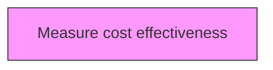
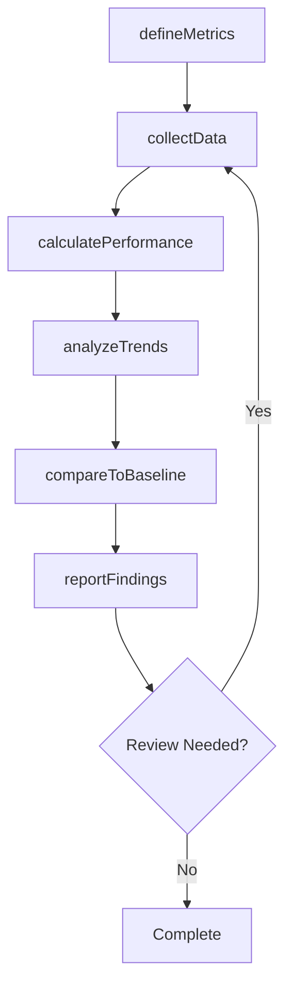

# Measure cost effectiveness

> Business-as-Code definition for measure cost effectiveness. Models the process of measuring the cost effectiveness of the organization's processes.

## Overview

Measuring the cost effectiveness of the organization's processes. Track the return on investing in marketing campaigns, new equipment, and process redefinition. Measure the cost per employee or cost per cycle for a given process, function, or business unit.

## Process Hierarchy



## GraphDL

```yaml
measure:
  object: Cost Effectiveness
  actor: PerformanceAnalyst
  result: costEffectivenessResult
```

## Actions

| Action | Description |
|--------|-------------|
| defineMetrics | Establish measurement criteria and indicators for cost effectiveness |
| collectData | Gather performance data for cost effectiveness |
| calculatePerformance | Compute performance measures for cost effectiveness |
| analyzeTrends | Identify patterns and trends in cost effectiveness data |
| compareToBaseline | Benchmark cost effectiveness against established targets |
| reportFindings | Generate and distribute cost effectiveness performance reports |

## Events

| Event | Description |
|-------|-------------|
| metricsDefined | Measurement criteria and indicators established |
| dataCollected | Performance data gathered |
| performanceCalculated | Performance measures computed |
| trendsAnalyzed | Performance trends analyzed |
| baselineCompared | Performance benchmarked against established targets |
| findingsReported | Performance findings reported |

## Searches

| Search | Description |
|--------|-------------|
| findCostEffectiveness | Retrieve cost effectiveness records filtered by status, date, or scope |
| getCostEffectivenessDetails | Get detailed information for a specific cost effectiveness record |
| listCostEffectivenessHistory | Query the history of changes and updates to cost effectiveness |
| getActiveItems | List currently active items related to cost effectiveness |

## Process Flow



## RACI Matrix

| Activity | Responsible | Accountable | Consulted | Informed |
|----------|-------------|-------------|-----------|----------|
| defineMetrics | PerformanceAnalyst | MetricsManager | ProcessOwners | Stakeholders |
| collectData | BenchmarkingLead | MetricsManager | Finance | Stakeholders |
| calculatePerformance | MetricsManager | VPStrategy | Operations | Stakeholders |
| analyzeTrends | PerformanceAnalyst | BenchmarkingLead | QualityManagement | Stakeholders |

## Related Processes

| Process | Relationship |
|---------|-------------|
| 13.6.1 Create and manage organizational performance strategy | Upstream - strategy drives measurement approach |
| 13.6.2 Benchmark performance | Parallel - benchmarking provides comparison data |
| 13.6.3 Evaluate process performance | Downstream - process metrics feed evaluation |

## Related Departments

| Department | Role |
|-----------|------|
| Strategy | Sets performance targets aligned with strategic goals |
| Operations | Provides operational performance data and implements improvements |
| Finance | Contributes financial metrics and cost analysis |
| Quality | Integrates quality metrics into performance measurement |

## Related Occupations

| Occupation | Involvement |
|-----------|-------------|
| Performance Analyst | Collects and analyzes performance data |
| Benchmarking Lead | Conducts internal and external benchmarking studies |
| Business Intelligence Analyst | Develops dashboards and performance reports |

## KPIs

| KPI | Description | Unit |
|-----|-------------|------|
| Metric Coverage | Percentage of key processes with defined performance metrics | % |
| Data Collection Timeliness | Percentage of performance data collected on schedule | % |
| Benchmark Gap | Average performance gap versus industry benchmarks | % |
| Improvement Action Completion | Percentage of improvement actions completed on time | % |

## Usage

```typescript
import { measureCostEffectiveness } from '@headlessly/measure-cost-effectiveness'

const client = measureCostEffectiveness()

// Establish measurement criteria and indicators for cost effectiveness
const result = await client.defineMetrics({
  scope: 'enterprise',
  period: 'Q1-2025'
})

// Gather performance data for cost effectiveness
const assessment = await client.collectData({
  resultId: result.id,
  criteria: 'standard'
})

// Compute performance measures for cost effectiveness
await client.calculatePerformance({
  resultId: result.id,
  format: 'detailed',
  recipients: ['stakeholders']
})
```
