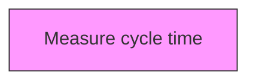
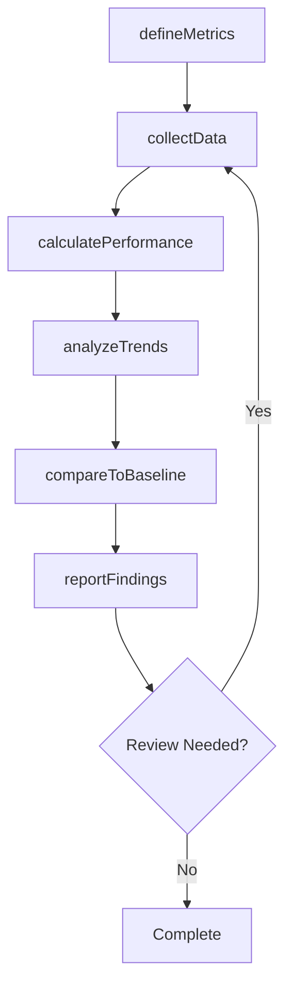

# Measure cycle time

> Business-as-Code definition for measure cycle time. Models the process of measuring how long it takes to perform certain processes or cycles of action.

## Overview

Measuring how long it takes to perform certain processes or cycles of action. Select measures of customer response time, invoicing, order to cash, etc. (Actions taken based on the measurement typically exist as activities within process group Manage change [11074] or within the other function specific categories. For example, if measures indicate that the invoicing cycle is taking too long or is inconsistent, the resulting actions would take place within process Invoice the customer [10742].)

## Process Hierarchy



## GraphDL

```yaml
measure:
  object: Cycle Time
  actor: PerformanceAnalyst
  result: cycleTimeResult
```

## Actions

| Action | Description |
|--------|-------------|
| defineMetrics | Establish measurement criteria and indicators for cycle time |
| collectData | Gather performance data for cycle time |
| calculatePerformance | Compute performance measures for cycle time |
| analyzeTrends | Identify patterns and trends in cycle time data |
| compareToBaseline | Benchmark cycle time against established targets |
| reportFindings | Generate and distribute cycle time performance reports |

## Events

| Event | Description |
|-------|-------------|
| metricsDefined | Measurement criteria and indicators established |
| dataCollected | Performance data gathered |
| performanceCalculated | Performance measures computed |
| trendsAnalyzed | Performance trends analyzed |
| baselineCompared | Performance benchmarked against established targets |
| findingsReported | Performance findings reported |

## Searches

| Search | Description |
|--------|-------------|
| findCycleTime | Retrieve cycle time records filtered by status, date, or scope |
| getCycleTimeDetails | Get detailed information for a specific cycle time record |
| listCycleTimeHistory | Query the history of changes and updates to cycle time |
| getActiveItems | List currently active items related to cycle time |

## Process Flow



## RACI Matrix

| Activity | Responsible | Accountable | Consulted | Informed |
|----------|-------------|-------------|-----------|----------|
| defineMetrics | PerformanceAnalyst | MetricsManager | ProcessOwners | Stakeholders |
| collectData | BenchmarkingLead | MetricsManager | Finance | Stakeholders |
| calculatePerformance | MetricsManager | VPStrategy | Operations | Stakeholders |
| analyzeTrends | PerformanceAnalyst | BenchmarkingLead | QualityManagement | Stakeholders |

## Related Processes

| Process | Relationship |
|---------|-------------|
| 13.6.1 Create and manage organizational performance strategy | Upstream - strategy drives measurement approach |
| 13.6.2 Benchmark performance | Parallel - benchmarking provides comparison data |
| 13.6.3 Evaluate process performance | Downstream - process metrics feed evaluation |

## Related Departments

| Department | Role |
|-----------|------|
| Strategy | Sets performance targets aligned with strategic goals |
| Operations | Provides operational performance data and implements improvements |
| Finance | Contributes financial metrics and cost analysis |
| Quality | Integrates quality metrics into performance measurement |

## Related Occupations

| Occupation | Involvement |
|-----------|-------------|
| Performance Analyst | Collects and analyzes performance data |
| Benchmarking Lead | Conducts internal and external benchmarking studies |
| Business Intelligence Analyst | Develops dashboards and performance reports |

## KPIs

| KPI | Description | Unit |
|-----|-------------|------|
| Metric Coverage | Percentage of key processes with defined performance metrics | % |
| Data Collection Timeliness | Percentage of performance data collected on schedule | % |
| Benchmark Gap | Average performance gap versus industry benchmarks | % |
| Improvement Action Completion | Percentage of improvement actions completed on time | % |

## Usage

```typescript
import { measureCycleTime } from '@headlessly/measure-cycle-time'

const client = measureCycleTime()

// Establish measurement criteria and indicators for cycle time
const result = await client.defineMetrics({
  scope: 'enterprise',
  period: 'Q1-2025'
})

// Gather performance data for cycle time
const assessment = await client.collectData({
  resultId: result.id,
  criteria: 'standard'
})

// Compute performance measures for cycle time
await client.calculatePerformance({
  resultId: result.id,
  format: 'detailed',
  recipients: ['stakeholders']
})
```
