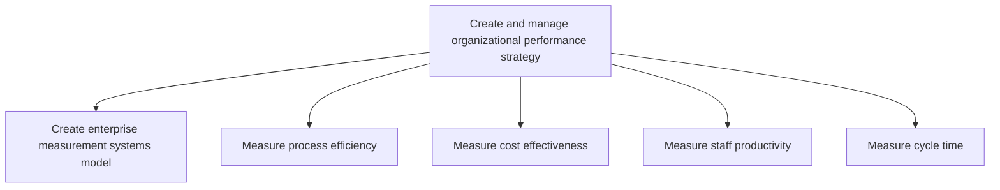
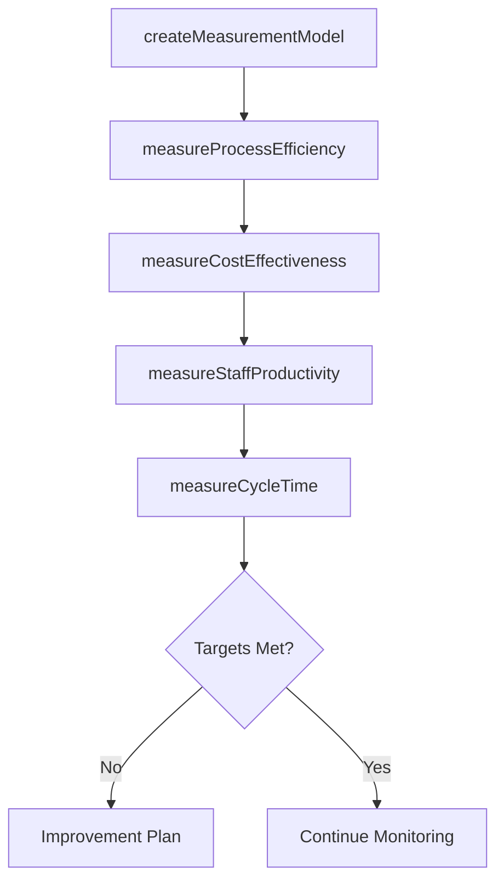

# Create and manage organizational performance strategy

> Business-as-Code definition for organizational performance strategy. Models the creation of enterprise measurement systems and the systematic measurement of process efficiency, cost effectiveness, staff productivity, and cycle time.

## Overview

Creating and implementing a strategy for administering organizational performance. This process element calls upon the organization to create and administer a strategy for measuring, tracking, streamlining, and improving internal performance. It encompasses creating a blueprint for the tactical measurement of internal processes and work force improvement, in alignment with Employee Metrics Developed and Managed [10526].

## Process Hierarchy



## GraphDL

```yaml
create:
  object: And Manage Organizational Performance Strategy
  actor: PerformanceStrategyManager
  result: MeasurementSystemsModel
```

## Actions

| Action | Description |
|--------|-------------|
| createMeasurementModel | Design the enterprise measurement framework linking KPIs to strategic objectives |
| measureProcessEfficiency | Evaluate process throughput, waste, and value-add ratios |
| measureCostEffectiveness | Track return on investment and cost-per-unit for key processes |
| measureStaffProductivity | Assess output per employee and identify automation opportunities |
| measureCycleTime | Track end-to-end process duration and identify bottlenecks |

## Events

| Event | Description |
|-------|-------------|
| measurementModelCreated | Enterprise measurement framework designed and approved |
| processEfficiencyMeasured | Process efficiency data collected and analyzed |
| costEffectivenessMeasured | Cost effectiveness metrics calculated and reported |
| staffProductivityMeasured | Staff productivity assessment completed |
| cycleTimeMeasured | Process cycle time data collected and analyzed |

## Searches

| Search | Description |
|--------|-------------|
| getMeasurementModel | Retrieve the enterprise measurement framework |
| getEfficiencyMetrics | Retrieve process efficiency metrics by process or department |
| getCostMetrics | Retrieve cost effectiveness data for a process or business unit |
| getProductivityMetrics | Retrieve staff productivity measures |

## Process Flow



## RACI Matrix

| Activity | Responsible | Accountable | Consulted | Informed |
|----------|-------------|-------------|-----------|----------|
| createMeasurementModel | PerformanceAnalyst | VP Operations | Finance | Executive |
| measureProcessEfficiency | ProcessAnalyst | PerformanceStrategyManager | ProcessOwners | Operations |
| measureCostEffectiveness | FinancialAnalyst | CFO | PerformanceStrategyManager | Board |
| measureCycleTime | ProcessAnalyst | PerformanceStrategyManager | IT | Operations |

## Sub-Processes

| ID | Name | Description |
|----|------|-------------|
| 13.6.1.1 | Create enterprise measurement systems model | Developing a model for organization's management systems. Develop a high-level measurement system to |
| 13.6.1.2 | Measure process efficiency | Evaluating the efficiency of the organization's processes. Adapt evaluation to the activities and bu |
| 13.6.1.3 | Measure cost effectiveness | Measuring the cost effectiveness of the organization's processes. Track the return on investing in m |
| 13.6.1.4 | Measure staff productivity | Evaluating the productivity of employees. Measure activities performed to determine where automation |
| 13.6.1.5 | Measure cycle time | Measuring how long it takes to perform certain processes or cycles of action. Select measures of cus |

## Related Processes

| Process | Relationship |
|---------|-------------|
| 13.6.2 Benchmark performance | Downstream - measurement data feeds benchmarking comparisons |
| 13.6.3 Evaluate process performance | Downstream - strategy defines how processes are evaluated |
| 13.1.4 Manage process performance | Parallel - process performance management uses these measures |

## Related Departments

| Department | Role |
|-----------|------|
| Business Performance | Primary owner of the measurement strategy |
| Finance | Provides cost effectiveness data and analysis |
| Operations | Supplies process efficiency and productivity data |
| IT | Enables data collection and reporting infrastructure |

## Related Occupations

| Occupation | Involvement |
|-----------|-------------|
| Performance Analyst | Designs measurement models and analyzes metrics |
| Financial Analyst | Calculates cost effectiveness measures |
| Process Analyst | Measures process efficiency and cycle time |

## KPIs

| KPI | Description | Unit |
|-----|-------------|------|
| Measurement Coverage | Percentage of critical processes with defined performance indicators | % |
| Data Collection Timeliness | Percentage of metrics updated within their scheduled frequency | % |
| Process Efficiency Index | Composite ratio of value-add activities to total activities | Ratio |
| Cost Per Transaction | Average cost to execute a standard business process instance | Currency |

## Usage

```typescript
import { createAndManageOrganizationalPerformanceStrategy } from '@headlessly/create-and-manage-organizational-performance-strategy'

const perfStrategy = createAndManageOrganizationalPerformanceStrategy()

// Create enterprise measurement model
const model = await perfStrategy.createMeasurementModel({
  strategicObjectives: ['revenue-growth', 'operational-excellence', 'customer-satisfaction'],
  perspectives: ['financial', 'customer', 'process', 'learning']
})

// Measure cycle time for order fulfillment
const cycleTime = await perfStrategy.measureCycleTime({
  processId: 'PRC-order-fulfillment',
  period: '2026-Q1',
  granularity: 'weekly'
})
```
