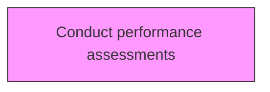
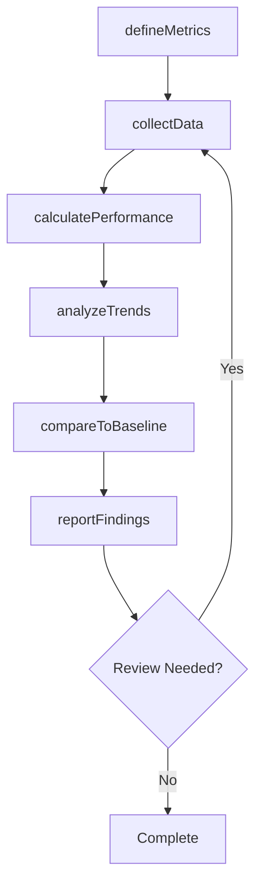

# Conduct performance assessments

> Business-as-Code definition for conduct performance assessments. Models the process of measuring, researching, and recording the performance of people, processes, mechanisms, or other areas of the business that the organization wants to benchmark or track.

## Overview

Measuring, researching, and recording the performance of people, processes, mechanisms, or other areas of the business that the organization wants to benchmark or track.

## Process Hierarchy



## GraphDL

```yaml
conduct:
  object: Performance Assessments
  actor: PerformanceAnalyst
  result: performanceAssessmentsResult
```

## Actions

| Action | Description |
|--------|-------------|
| defineMetrics | Establish measurement criteria and indicators for performance assessments |
| collectData | Gather performance data for performance assessments |
| calculatePerformance | Compute performance measures for performance assessments |
| analyzeTrends | Identify patterns and trends in performance assessments data |
| compareToBaseline | Benchmark performance assessments against established targets |
| reportFindings | Generate and distribute performance assessments performance reports |

## Events

| Event | Description |
|-------|-------------|
| metricsDefined | Measurement criteria and indicators established |
| dataCollected | Performance data gathered |
| performanceCalculated | Performance measures computed |
| trendsAnalyzed | Performance trends analyzed |
| baselineCompared | Performance benchmarked against established targets |
| findingsReported | Performance findings reported |

## Searches

| Search | Description |
|--------|-------------|
| findPerformanceAssessments | Retrieve performance assessments records filtered by status, date, or scope |
| getPerformanceAssessmentsDetails | Get detailed information for a specific performance assessments record |
| listPerformanceAssessmentsHistory | Query the history of changes and updates to performance assessments |
| getActiveItems | List currently active items related to performance assessments |

## Process Flow



## RACI Matrix

| Activity | Responsible | Accountable | Consulted | Informed |
|----------|-------------|-------------|-----------|----------|
| defineMetrics | PerformanceAnalyst | MetricsManager | ProcessOwners | Stakeholders |
| collectData | BenchmarkingLead | MetricsManager | Finance | Stakeholders |
| calculatePerformance | MetricsManager | VPStrategy | Operations | Stakeholders |
| analyzeTrends | PerformanceAnalyst | BenchmarkingLead | QualityManagement | Stakeholders |

## Related Processes

| Process | Relationship |
|---------|-------------|
| 13.6.1 Create and manage organizational performance strategy | Upstream - strategy drives measurement approach |
| 13.6.2 Benchmark performance | Parallel - benchmarking provides comparison data |
| 13.6.3 Evaluate process performance | Downstream - process metrics feed evaluation |

## Related Departments

| Department | Role |
|-----------|------|
| Strategy | Sets performance targets aligned with strategic goals |
| Operations | Provides operational performance data and implements improvements |
| Finance | Contributes financial metrics and cost analysis |
| Quality | Integrates quality metrics into performance measurement |

## Related Occupations

| Occupation | Involvement |
|-----------|-------------|
| Performance Analyst | Collects and analyzes performance data |
| Benchmarking Lead | Conducts internal and external benchmarking studies |
| Business Intelligence Analyst | Develops dashboards and performance reports |

## KPIs

| KPI | Description | Unit |
|-----|-------------|------|
| Metric Coverage | Percentage of key processes with defined performance metrics | % |
| Data Collection Timeliness | Percentage of performance data collected on schedule | % |
| Benchmark Gap | Average performance gap versus industry benchmarks | % |
| Improvement Action Completion | Percentage of improvement actions completed on time | % |

## Usage

```typescript
import { conductPerformanceAssessments } from '@headlessly/conduct-performance-assessments'

const client = conductPerformanceAssessments()

// Establish measurement criteria and indicators for performance assessments
const result = await client.defineMetrics({
  scope: 'enterprise',
  period: 'Q1-2025'
})

// Gather performance data for performance assessments
const assessment = await client.collectData({
  resultId: result.id,
  criteria: 'standard'
})

// Compute performance measures for performance assessments
await client.calculatePerformance({
  resultId: result.id,
  format: 'detailed',
  recipients: ['stakeholders']
})
```
