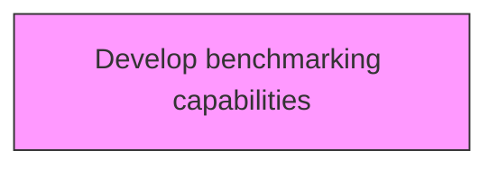
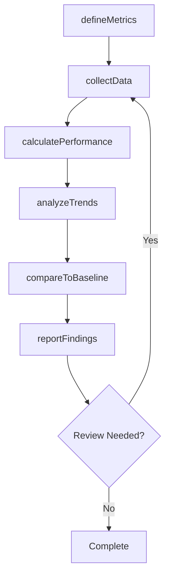

# Develop benchmarking capabilities

> Business-as-Code definition for develop benchmarking capabilities. Models the process of improving an organization's ability to compare its performance internally or externally, and maintaining benchmarking relationships with other organizations.

## Overview

Improving an organization's ability to compare its performance internally or externally, and maintaining benchmarking relationships with other organizations. Train staff in benchmarking. Develop technological solutions or other materials to aid benchmarking efforts. Consult with external entities to gain knowledge or tools to help benchmark.

## Process Hierarchy



## GraphDL

```yaml
develop:
  object: Benchmarking Capabilities
  actor: PerformanceAnalyst
  result: benchmarkingCapabilitiesResult
```

## Actions

| Action | Description |
|--------|-------------|
| defineMetrics | Establish measurement criteria and indicators for benchmarking capabilities |
| collectData | Gather performance data for benchmarking capabilities |
| calculatePerformance | Compute performance measures for benchmarking capabilities |
| analyzeTrends | Identify patterns and trends in benchmarking capabilities data |
| compareToBaseline | Benchmark benchmarking capabilities against established targets |
| reportFindings | Generate and distribute benchmarking capabilities performance reports |

## Events

| Event | Description |
|-------|-------------|
| metricsDefined | Measurement criteria and indicators established |
| dataCollected | Performance data gathered |
| performanceCalculated | Performance measures computed |
| trendsAnalyzed | Performance trends analyzed |
| baselineCompared | Performance benchmarked against established targets |
| findingsReported | Performance findings reported |

## Searches

| Search | Description |
|--------|-------------|
| findBenchmarkingCapabilities | Retrieve benchmarking capabilities records filtered by status, date, or scope |
| getBenchmarkingCapabilitiesDetails | Get detailed information for a specific benchmarking capabilities record |
| listBenchmarkingCapabilitiesHistory | Query the history of changes and updates to benchmarking capabilities |
| getActiveItems | List currently active items related to benchmarking capabilities |

## Process Flow



## RACI Matrix

| Activity | Responsible | Accountable | Consulted | Informed |
|----------|-------------|-------------|-----------|----------|
| defineMetrics | PerformanceAnalyst | MetricsManager | ProcessOwners | Stakeholders |
| collectData | BenchmarkingLead | MetricsManager | Finance | Stakeholders |
| calculatePerformance | MetricsManager | VPStrategy | Operations | Stakeholders |
| analyzeTrends | PerformanceAnalyst | BenchmarkingLead | QualityManagement | Stakeholders |

## Related Processes

| Process | Relationship |
|---------|-------------|
| 13.6.1 Create and manage organizational performance strategy | Upstream - strategy drives measurement approach |
| 13.6.2 Benchmark performance | Parallel - benchmarking provides comparison data |
| 13.6.3 Evaluate process performance | Downstream - process metrics feed evaluation |

## Related Departments

| Department | Role |
|-----------|------|
| Strategy | Sets performance targets aligned with strategic goals |
| Operations | Provides operational performance data and implements improvements |
| Finance | Contributes financial metrics and cost analysis |
| Quality | Integrates quality metrics into performance measurement |

## Related Occupations

| Occupation | Involvement |
|-----------|-------------|
| Performance Analyst | Collects and analyzes performance data |
| Benchmarking Lead | Conducts internal and external benchmarking studies |
| Business Intelligence Analyst | Develops dashboards and performance reports |

## KPIs

| KPI | Description | Unit |
|-----|-------------|------|
| Metric Coverage | Percentage of key processes with defined performance metrics | % |
| Data Collection Timeliness | Percentage of performance data collected on schedule | % |
| Benchmark Gap | Average performance gap versus industry benchmarks | % |
| Improvement Action Completion | Percentage of improvement actions completed on time | % |

## Usage

```typescript
import { developBenchmarkingCapabilities } from '@headlessly/develop-benchmarking-capabilities'

const client = developBenchmarkingCapabilities()

// Establish measurement criteria and indicators for benchmarking capabilities
const result = await client.defineMetrics({
  scope: 'enterprise',
  period: 'Q1-2025'
})

// Gather performance data for benchmarking capabilities
const assessment = await client.collectData({
  resultId: result.id,
  criteria: 'standard'
})

// Compute performance measures for benchmarking capabilities
await client.calculatePerformance({
  resultId: result.id,
  format: 'detailed',
  recipients: ['stakeholders']
})
```
