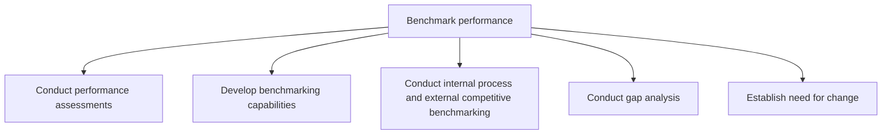
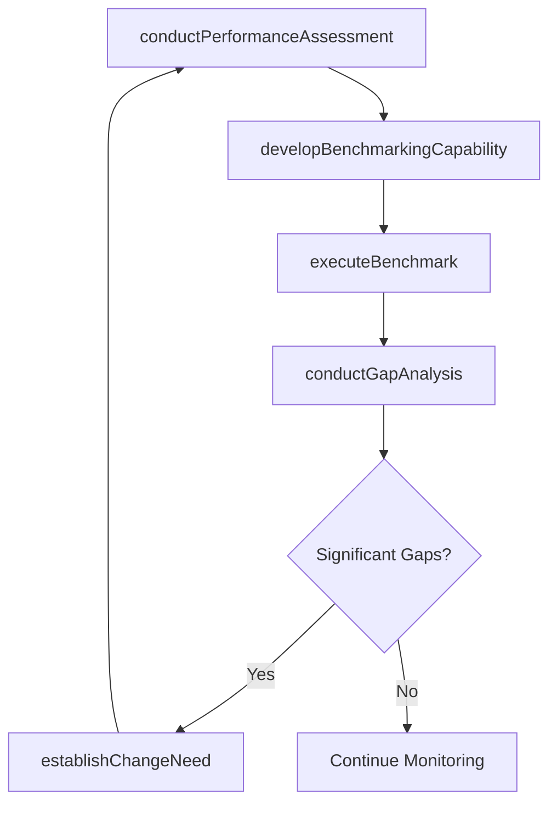

# Benchmark performance

> Business-as-Code definition for performance benchmarking. Models the assessment of organizational performance, development of benchmarking capabilities, execution of internal and external comparisons, gap analysis, and establishment of change needs.

## Overview

Comparing organizational performance internally or externally with other organizations.

## Process Hierarchy



## GraphDL

```yaml
benchmark:
  object: Performance
  actor: BenchmarkingSpecialist
  result: BenchmarkReport
```

## Actions

| Action | Description |
|--------|-------------|
| conductPerformanceAssessment | Measure and record current performance across key dimensions |
| developBenchmarkingCapability | Build organizational skills and tools for ongoing benchmarking |
| executeBenchmark | Compare performance against internal historical data or external peers |
| conductGapAnalysis | Identify and quantify performance gaps relative to benchmark targets |
| establishChangeNeed | Translate gap analysis findings into prioritized change requirements |

## Events

| Event | Description |
|-------|-------------|
| performanceAssessmentConducted | Current performance measured and baseline documented |
| benchmarkingCapabilityDeveloped | Benchmarking tools, partnerships, and skills established |
| benchmarkExecuted | Internal or external benchmarking comparison completed |
| gapAnalysisConducted | Performance gaps identified and quantified |
| changeNeedEstablished | Change requirements derived from gap analysis and prioritized |

## Searches

| Search | Description |
|--------|-------------|
| getBenchmarkResults | Retrieve benchmarking comparison results by process or metric |
| findPerformanceGaps | List identified gaps by size, impact, or process area |
| getBenchmarkPartners | Retrieve available benchmarking consortia and comparator sets |
| getChangeRequirements | Retrieve prioritized change needs from gap analysis |

## Process Flow



## RACI Matrix

| Activity | Responsible | Accountable | Consulted | Informed |
|----------|-------------|-------------|-----------|----------|
| conductPerformanceAssessment | PerformanceAnalyst | VP Operations | ProcessOwners | Executive |
| executeBenchmark | BenchmarkingSpecialist | VP Operations | IndustryAssociations | CFO |
| conductGapAnalysis | PerformanceAnalyst | VP Operations | ProcessOwners | SteeringCommittee |
| establishChangeNeed | VP Operations | CEO | ChangeManager | Board |

## Sub-Processes

| ID | Name | Description |
|----|------|-------------|
| 13.6.2.1 | Conduct performance assessments | Measuring, researching, and recording the performance of people, processes, mechanisms, or other are |
| 13.6.2.2 | Develop benchmarking capabilities | Improving an organization's ability to compare its performance internally or externally, and maintai |
| 13.6.2.3 | Conduct internal process and external competitive benchmarking | Benchmarking internal processes and against external competitors. |
| 13.6.2.4 | Conduct gap analysis | Examining performance against benchmarked organizations or entities. Determine how much performance  |
| 13.6.2.5 | Establish need for change | Establishing a need for changing the performance of the organization. Make use of the gap analysis r |

## Related Processes

| Process | Relationship |
|---------|-------------|
| 13.6.1 Create and manage organizational performance strategy | Upstream - measurement strategy provides data for benchmarking |
| 13.6.3 Evaluate process performance | Parallel - process evaluation and benchmarking share data |
| 13.4 Manage change | Downstream - gap analysis triggers change initiatives |

## Related Departments

| Department | Role |
|-----------|------|
| Business Performance | Primary owner of benchmarking methodology and execution |
| Strategy | Consumes benchmark data for strategic positioning |
| Finance | Provides financial performance data for comparison |
| Operations | Supplies operational metrics for benchmarking |

## Related Occupations

| Occupation | Involvement |
|-----------|-------------|
| Benchmarking Specialist | Designs and executes benchmarking studies |
| Performance Analyst | Conducts gap analysis and performance assessment |
| Strategy Analyst | Translates benchmark findings into strategic actions |

## KPIs

| KPI | Description | Unit |
|-----|-------------|------|
| Benchmark Participation Rate | Number of benchmarking studies completed per year | Count |
| Gap Closure Rate | Percentage of identified gaps addressed within 12 months | % |
| Comparator Set Size | Number of peer organizations in the benchmark comparator set | Count |
| Benchmarking Cycle Time | Time from study initiation to final report | Weeks |

## Usage

```typescript
import { benchmarkPerformance } from '@headlessly/benchmark-performance'

const benchmark = benchmarkPerformance()

// Execute an external benchmark for procure-to-pay
const results = await benchmark.executeBenchmark({
  process: 'procure-to-pay',
  metrics: ['cycle-time', 'cost-per-invoice', 'automation-rate'],
  comparatorSet: 'APQC-cross-industry',
  targetPercentile: 'top-quartile'
})

// Conduct gap analysis
const gaps = await benchmark.conductGapAnalysis({
  benchmarkId: results.id,
  significanceThreshold: 0.15
})
```
