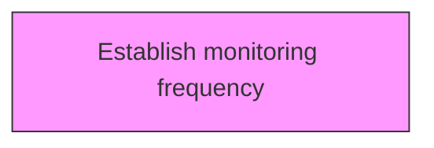
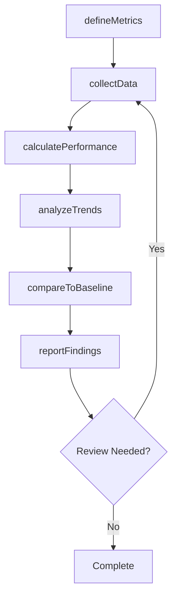

# Establish monitoring frequency

> Business-as-Code definition for establish monitoring frequency. Models the process of deciding on the appropriate amount of supervisions that are needed to effectively assess the performance of business plans.

## Overview

Deciding on the appropriate amount of supervisions that are needed to effectively assess the performance of business plans.

## Process Hierarchy



## GraphDL

```yaml
establish:
  object: Monitoring Frequency
  actor: PerformanceAnalyst
  result: monitoringFrequencyResult
```

## Actions

| Action | Description |
|--------|-------------|
| defineMetrics | Establish measurement criteria and indicators for monitoring frequency |
| collectData | Gather performance data for monitoring frequency |
| calculatePerformance | Compute performance measures for monitoring frequency |
| analyzeTrends | Identify patterns and trends in monitoring frequency data |
| compareToBaseline | Benchmark monitoring frequency against established targets |
| reportFindings | Generate and distribute monitoring frequency performance reports |

## Events

| Event | Description |
|-------|-------------|
| metricsDefined | Measurement criteria and indicators established |
| dataCollected | Performance data gathered |
| performanceCalculated | Performance measures computed |
| trendsAnalyzed | Performance trends analyzed |
| baselineCompared | Performance benchmarked against established targets |
| findingsReported | Performance findings reported |

## Searches

| Search | Description |
|--------|-------------|
| findMonitoringFrequency | Retrieve monitoring frequency records filtered by status, date, or scope |
| getMonitoringFrequencyDetails | Get detailed information for a specific monitoring frequency record |
| listMonitoringFrequencyHistory | Query the history of changes and updates to monitoring frequency |
| getActiveItems | List currently active items related to monitoring frequency |

## Process Flow



## RACI Matrix

| Activity | Responsible | Accountable | Consulted | Informed |
|----------|-------------|-------------|-----------|----------|
| defineMetrics | PerformanceAnalyst | MetricsManager | ProcessOwners | Stakeholders |
| collectData | BenchmarkingLead | MetricsManager | Finance | Stakeholders |
| calculatePerformance | MetricsManager | VPStrategy | Operations | Stakeholders |
| analyzeTrends | PerformanceAnalyst | BenchmarkingLead | QualityManagement | Stakeholders |

## Related Processes

| Process | Relationship |
|---------|-------------|
| 13.6.1 Create and manage organizational performance strategy | Upstream - strategy drives measurement approach |
| 13.6.2 Benchmark performance | Parallel - benchmarking provides comparison data |
| 13.6.3 Evaluate process performance | Downstream - process metrics feed evaluation |

## Related Departments

| Department | Role |
|-----------|------|
| Strategy | Sets performance targets aligned with strategic goals |
| Operations | Provides operational performance data and implements improvements |
| Finance | Contributes financial metrics and cost analysis |
| Quality | Integrates quality metrics into performance measurement |

## Related Occupations

| Occupation | Involvement |
|-----------|-------------|
| Performance Analyst | Collects and analyzes performance data |
| Benchmarking Lead | Conducts internal and external benchmarking studies |
| Business Intelligence Analyst | Develops dashboards and performance reports |

## KPIs

| KPI | Description | Unit |
|-----|-------------|------|
| Metric Coverage | Percentage of key processes with defined performance metrics | % |
| Data Collection Timeliness | Percentage of performance data collected on schedule | % |
| Benchmark Gap | Average performance gap versus industry benchmarks | % |
| Improvement Action Completion | Percentage of improvement actions completed on time | % |

## Usage

```typescript
import { establishMonitoringFrequency } from '@headlessly/establish-monitoring-frequency'

const client = establishMonitoringFrequency()

// Establish measurement criteria and indicators for monitoring frequency
const result = await client.defineMetrics({
  scope: 'enterprise',
  period: 'Q1-2025'
})

// Gather performance data for monitoring frequency
const assessment = await client.collectData({
  resultId: result.id,
  criteria: 'standard'
})

// Compute performance measures for monitoring frequency
await client.calculatePerformance({
  resultId: result.id,
  format: 'detailed',
  recipients: ['stakeholders']
})
```
