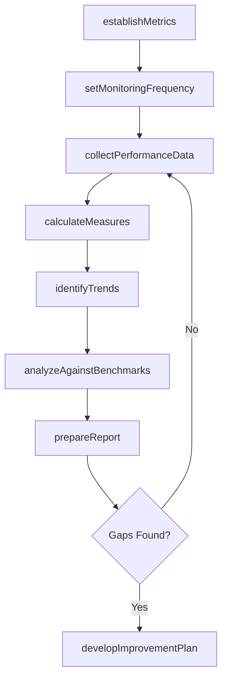

# Evaluate process performance

> Business-as-Code definition for process performance evaluation. Models the end-to-end cycle of establishing metrics, collecting data, calculating measures, identifying trends, analyzing against benchmarks, reporting, and developing improvement plans.

## Overview

Assessing process data, measures, and trends in an effort to evaluate process performance and identify possible improvements.

## Process Hierarchy

```mermaid
graph TD
    A[Evaluate process performance]
    A --> B[Establish appropriate performance indicators (metrics)]
    A --> C[Establish monitoring frequency]
    A --> D[Collect performance data]
    A --> E[Calculate performance measures]
    A --> F[Identify performance trends]
    A --> G[Analyze performance against benchmark data]
    A --> H[Prepare reports]
    A --> I[Develop performance improvement plan]
```

## GraphDL

```yaml
evaluate:
  object: Process Performance
  actor: ProcessPerformanceAnalyst
  result: PerformanceEvaluationReport
```

## Actions

| Action | Description |
|--------|-------------|
| establishMetrics | Define appropriate performance indicators for each process |
| setMonitoringFrequency | Determine the cadence for data collection and review |
| collectPerformanceData | Gather performance data from process execution systems |
| calculateMeasures | Compute performance metrics from collected data |
| identifyTrends | Analyze performance data over time to detect patterns and trends |
| analyzeAgainstBenchmarks | Compare calculated performance against benchmark targets |
| prepareReport | Generate performance evaluation reports with visualizations |
| developImprovementPlan | Create action plans to close performance gaps |

## Events

| Event | Description |
|-------|-------------|
| metricsEstablished | Performance indicators defined and baselined |
| monitoringFrequencySet | Data collection and review cadence approved |
| performanceDataCollected | Performance data gathered and validated |
| measurersCalculated | Performance metrics computed and stored |
| trendsIdentified | Performance trends detected and documented |
| benchmarkAnalysisCompleted | Performance compared against benchmark targets |
| reportPrepared | Performance evaluation report published |
| improvementPlanDeveloped | Performance improvement action plan approved |

## Searches

| Search | Description |
|--------|-------------|
| getProcessMetrics | Retrieve current performance metrics for a process |
| getPerformanceTrends | Retrieve historical trend data for a metric |
| findUnderperformingProcesses | List processes performing below benchmark targets |
| getImprovementPlans | Retrieve active improvement plans by process or department |

## Process Flow



## RACI Matrix

| Activity | Responsible | Accountable | Consulted | Informed |
|----------|-------------|-------------|-----------|----------|
| establishMetrics | ProcessPerformanceAnalyst | VP Operations | ProcessOwners | Finance |
| collectPerformanceData | DataAnalyst | ProcessPerformanceAnalyst | IT | ProcessOwners |
| analyzeAgainstBenchmarks | ProcessPerformanceAnalyst | VP Operations | BenchmarkingTeam | Executive |
| developImprovementPlan | ProcessOwner | VP Operations | ContinuousImprovement | SteeringCommittee |

## Sub-Processes

| ID | Name | Description |
|----|------|-------------|
| 13.6.3.1 | Establish appropriate performance indicators (metrics) | Designing key measures that analyze and interpret how effectively the business is achieving its obje |
| 13.6.3.2 | Establish monitoring frequency | Deciding on the appropriate amount of supervisions that are needed to effectively assess the perform |
| 13.6.3.3 | Collect performance data | Consolidating acquired metrics and trends. Provide data that can be benchmarked against historical d |
| 13.6.3.4 | Calculate performance measures | Measuring the performance of process planning. Quantify the performance, record results of the perfo |
| 13.6.3.5 | Identify performance trends | Recognizing the trends in performance. Carefully and strategically assess the results in order to ef |
| 13.6.3.6 | Analyze performance against benchmark data | Evaluating the gaps between achieved and benchmarked performance. Analyze how performance differs fr |
| 13.6.3.7 | Prepare reports | Creating reports that systematically record and represent the performance planning. Construct a deta |
| 13.6.3.8 | Develop performance improvement plan | Using performance indicators to report, analyze, and create a detailed performance improvement plan  |

## Related Processes

| Process | Relationship |
|---------|-------------|
| 13.6.1 Create and manage organizational performance strategy | Upstream - strategy defines the measurement framework |
| 13.6.2 Benchmark performance | Parallel - benchmark data provides comparison targets |
| 13.1.5 Improve processes | Downstream - performance gaps drive improvement initiatives |

## Related Departments

| Department | Role |
|-----------|------|
| Business Performance | Primary owner of process performance evaluation |
| IT | Provides data collection and reporting infrastructure |
| Operations | Process owners supply operational data and context |
| Continuous Improvement | Consumes evaluation outputs to prioritize improvement |

## Related Occupations

| Occupation | Involvement |
|-----------|-------------|
| Process Performance Analyst | Establishes metrics and analyzes performance data |
| Data Analyst | Collects and prepares performance datasets |
| Process Owner | Provides context and acts on improvement plans |

## KPIs

| KPI | Description | Unit |
|-----|-------------|------|
| Metric Coverage | Percentage of critical processes with active performance indicators | % |
| Data Collection Accuracy | Percentage of performance data points validated without errors | % |
| Report Timeliness | Percentage of performance reports delivered on schedule | % |
| Improvement Plan Execution | Percentage of improvement actions completed on time | % |

## Usage

```typescript
import { evaluateProcessPerformance } from '@headlessly/evaluate-process-performance'

const evaluation = evaluateProcessPerformance()

// Establish metrics for a process
const metrics = await evaluation.establishMetrics({
  processId: 'PRC-accounts-payable',
  indicators: [
    { name: 'invoice-processing-time', target: 3, unit: 'days' },
    { name: 'cost-per-invoice', target: 5.50, unit: 'USD' },
    { name: 'first-time-match-rate', target: 0.85, unit: 'percentage' }
  ]
})

// Analyze against benchmarks
const analysis = await evaluation.analyzeAgainstBenchmarks({
  processId: 'PRC-accounts-payable',
  benchmarkSource: 'APQC-top-quartile',
  period: '2026-Q1'
})
```
