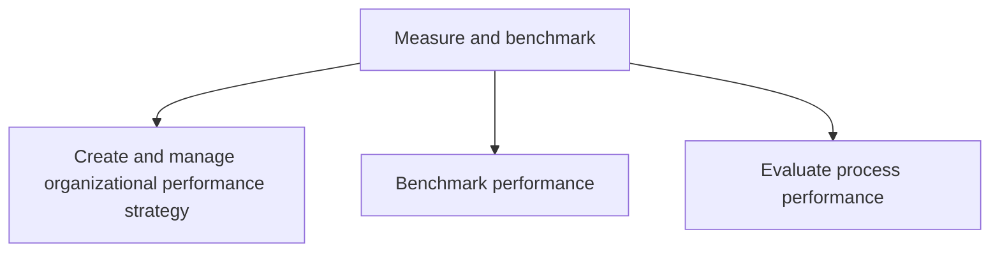
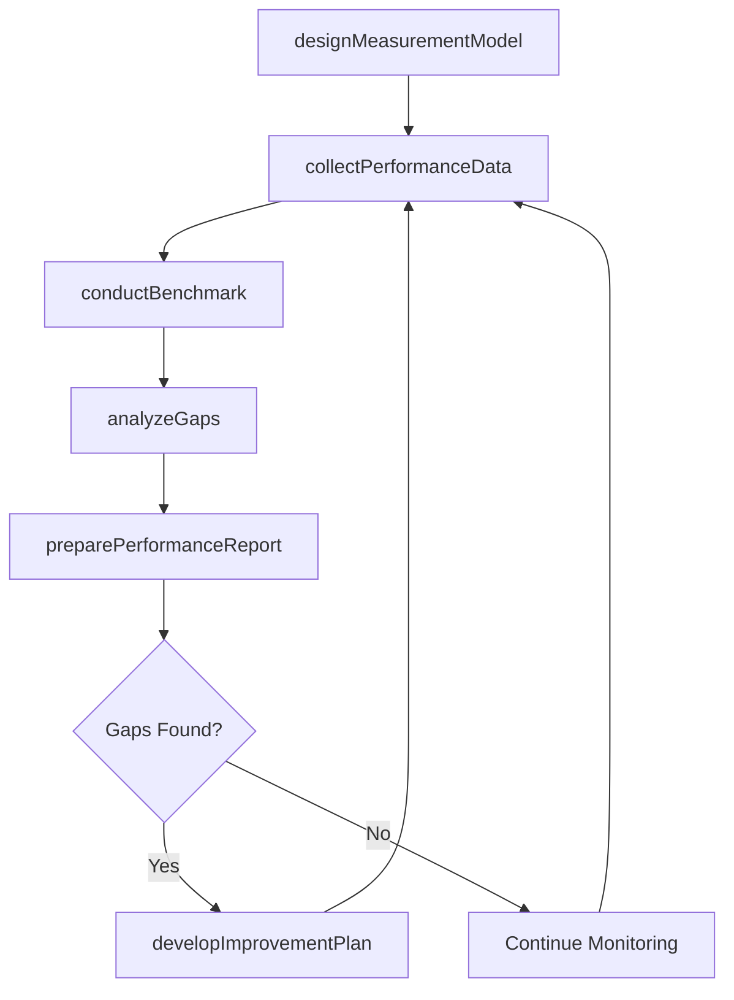

# Measure and benchmark

> Business-as-Code definition for organizational measurement and benchmarking. Models the complete performance management cycle from metric design and data collection through internal and external benchmarking to gap analysis and improvement planning.

## Overview

Creating and administering a strategy to manage organizational performance. Benchmark the performance of the internal processes, as well as the organization as a whole.

## Process Hierarchy



## GraphDL

```yaml
measure:
  object: And Benchmark
  actor: PerformanceAnalyst
  result: BenchmarkReport
```

## Actions

| Action | Description |
|--------|-------------|
| designMeasurementModel | Create an enterprise measurement framework linking KPIs to strategic goals |
| collectPerformanceData | Gather process efficiency, cost, productivity, and cycle time data |
| conductBenchmark | Compare internal performance against industry peers or best-in-class standards |
| analyzeGaps | Identify performance gaps between current state and benchmark targets |
| preparePerformanceReport | Generate performance dashboards and trend analysis for stakeholders |
| developImprovementPlan | Create action plans to close identified performance gaps |

## Events

| Event | Description |
|-------|-------------|
| measurementModelDesigned | Enterprise measurement framework approved and deployed |
| performanceDataCollected | Performance data gathered and validated for analysis |
| benchmarkConducted | Internal or external benchmarking comparison completed |
| gapsAnalyzed | Performance gap analysis documented with root causes |
| performanceReportPrepared | Performance report distributed to stakeholders |
| improvementPlanDeveloped | Action plan to close performance gaps approved |

## Searches

| Search | Description |
|--------|-------------|
| getPerformanceMetrics | Retrieve KPI values filtered by process, department, or time period |
| findBenchmarkData | List available benchmark comparisons by industry or process category |
| getGapAnalysis | Retrieve gap analysis results for a specific process or business unit |
| getTrendData | Get historical performance trend data for a metric |

## Process Flow



## RACI Matrix

| Activity | Responsible | Accountable | Consulted | Informed |
|----------|-------------|-------------|-----------|----------|
| designMeasurementModel | PerformanceAnalyst | VP Operations | ProcessOwners | CFO |
| collectPerformanceData | DataAnalyst | PerformanceAnalyst | IT | ProcessOwners |
| conductBenchmark | BenchmarkingSpecialist | VP Operations | IndustryAssociations | Executive |
| analyzeGaps | PerformanceAnalyst | VP Operations | ProcessOwners | SteeringCommittee |
| developImprovementPlan | ProcessOwner | VP Operations | PerformanceAnalyst | ExecutiveLeadership |

## Sub-Processes

| ID | Name | Description |
|----|------|-------------|
| 13.6.1 | Create and manage organizational performance strategy | Creating and implementing a strategy for administering organizational performance. This process elem |
| 13.6.2 | Benchmark performance | Comparing organizational performance internally or externally with other organizations. |
| 13.6.3 | Evaluate process performance | Assessing process data, measures, and trends in an effort to evaluate process performance and identi |

## Related Processes

| Process | Relationship |
|---------|-------------|
| 13.1 Manage business processes | Upstream - process definitions provide the objects being measured |
| 13.3 Manage enterprise quality | Parallel - quality metrics are a key dimension of performance measurement |
| 13.4 Manage change | Downstream - benchmark gaps trigger change initiatives |
| 13.5 Develop and manage enterprise-wide KM capability | Parallel - benchmarking insights feed the knowledge base |

## Related Departments

| Department | Role |
|-----------|------|
| Business Performance | Primary owner of measurement frameworks and benchmarking |
| Finance | Provides cost and financial performance data |
| Operations | Supplies process efficiency and productivity metrics |
| IT | Enables data collection, integration, and reporting platforms |
| Strategy | Consumes benchmark data for strategic planning |

## Related Occupations

| Occupation | Involvement |
|-----------|-------------|
| Performance Analyst | Designs measurement models and analyzes performance data |
| Benchmarking Specialist | Conducts internal and external benchmarking studies |
| Data Analyst | Collects, cleanses, and prepares performance datasets |
| Business Process Analyst | Connects performance data to process improvement actions |

## KPIs

| KPI | Description | Unit |
|-----|-------------|------|
| Measurement Coverage | Percentage of critical processes with active performance indicators | % |
| Benchmark Participation Rate | Number of benchmarking studies completed per year | Count |
| Gap Closure Rate | Percentage of identified performance gaps closed within target timeframe | % |
| Data Freshness | Average age of the most recent performance data point | Days |
| Improvement Plan Completion | Percentage of improvement actions completed on schedule | % |

## Usage

```typescript
import { measureAndBenchmark } from '@headlessly/measure-and-benchmark'

const perf = measureAndBenchmark()

// Conduct an external benchmark for order-to-cash cycle time
const benchmark = await perf.conductBenchmark({
  process: 'order-to-cash',
  metric: 'cycle-time',
  comparatorSet: 'industry-median',
  industry: 'manufacturing'
})

// Analyze gaps against benchmark targets
const gaps = await perf.analyzeGaps({
  benchmarkId: benchmark.id,
  threshold: 0.1
})
```
