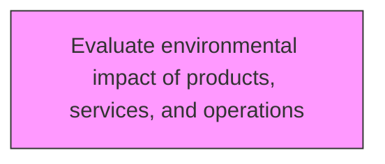
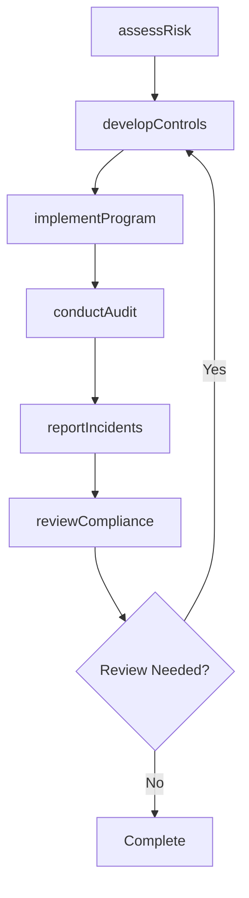

# Evaluate environmental impact of products, services, and operations

> Business-as-Code definition for evaluate environmental impact of products, services, and operations. Models the process of evaluating the impact of offerings and the auxiliary operations required to process them on the immediate ecosystem and the environment at large.

## Overview

Evaluating the impact of offerings and the auxiliary operations required to process them on the immediate ecosystem and the environment at large. Study the lifecycle of the products/services offered by the organization. Estimate any affect on the environment through metrics such as a calculation of carbon footprint.

## Process Hierarchy



## GraphDL

```yaml
evaluate:
  object: Environmental Impact Of Products, Services, And Operations
  actor: EHSManager
  result: environmentalImpactOfProductsServicesAndOperationsResult
```

## Actions

| Action | Description |
|--------|-------------|
| assessRisk | Evaluate environmental health and safety risks for environmental impact of products, services, and operations |
| developControls | Design preventive controls and procedures for environmental impact of products, services, and operations |
| implementProgram | Deploy the EHS program elements for environmental impact of products, services, and operations |
| conductAudit | Perform compliance audit for environmental impact of products, services, and operations |
| reportIncidents | Document and report incidents related to environmental impact of products, services, and operations |
| reviewCompliance | Verify regulatory compliance for environmental impact of products, services, and operations |

## Events

| Event | Description |
|-------|-------------|
| riskAssessed | Environmental health and safety risks evaluated |
| controlsDeveloped | Preventive controls and procedures designed |
| programImplemented | EHS program elements deployed |
| auditConducted | Compliance audit performed |
| incidentsReported | Incidents documented and reported |
| complianceReviewed | Regulatory compliance verified |

## Searches

| Search | Description |
|--------|-------------|
| findEnvironmentalImpactOfProductsServicesAndOperations | Retrieve environmental impact of products, services, and operations records filtered by status, date, or scope |
| getEnvironmentalImpactOfProductsServicesAndOperationsDetails | Get detailed information for a specific environmental impact of products, services, and operations record |
| listEnvironmentalImpactOfProductsServicesAndOperationsHistory | Query the history of changes and updates to environmental impact of products, services, and operations |
| getActiveItems | List currently active items related to environmental impact of products, services, and operations |

## Process Flow



## RACI Matrix

| Activity | Responsible | Accountable | Consulted | Informed |
|----------|-------------|-------------|-----------|----------|
| assessRisk | SafetyOfficer | EHSManager | Operations | Stakeholders |
| developControls | EnvironmentalSpecialist | EHSManager | RegulatoryAffairs | Stakeholders |
| implementProgram | EHSManager | VPOperations | Legal | Stakeholders |
| conductAudit | SafetyOfficer | EHSManager | HumanResources | Stakeholders |

## Related Processes

| Process | Relationship |
|---------|-------------|
| 13.7.1 Determine environmental health and safety impacts | Upstream - impact assessment informs EHS programs |
| 13.7.2 Develop and execute functional EHS program | Parallel - program development and execution |
| 13.7.4 Monitor and manage functional EHS management program | Downstream - ongoing monitoring and management |

## Related Departments

| Department | Role |
|-----------|------|
| Environment Health and Safety | Primary owner of EHS programs and compliance |
| Operations | Implements EHS requirements in operational activities |
| Legal | Advises on regulatory compliance and liability management |
| Human Resources | Supports EHS training and employee wellness programs |

## Related Occupations

| Occupation | Involvement |
|-----------|-------------|
| EHS Manager | Leads environmental health and safety programs |
| Safety Officer | Monitors workplace safety and incident response |
| Environmental Specialist | Manages environmental compliance and reporting |

## KPIs

| KPI | Description | Unit |
|-----|-------------|------|
| Incident Rate | Number of recordable incidents per 200,000 hours worked | Rate |
| Compliance Rate | Percentage compliance with EHS regulatory requirements | % |
| Training Completion | Percentage of employees completing required EHS training | % |
| Near Miss Reporting Rate | Number of near misses reported per period | Count |

## Usage

```typescript
import { evaluateEnvironmentalImpactOfProductsServicesAndOperations } from '@headlessly/evaluate-environmental-impact-of-products-services-and-operations'

const client = evaluateEnvironmentalImpactOfProductsServicesAndOperations()

// Evaluate environmental health and safety risks for environmental impact of products, services, and operations
const result = await client.assessRisk({
  scope: 'enterprise',
  period: 'Q1-2025'
})

// Design preventive controls and procedures for environmental impact of products, services, and operations
const assessment = await client.developControls({
  resultId: result.id,
  criteria: 'standard'
})

// Deploy the EHS program elements for environmental impact of products, services, and operations
await client.implementProgram({
  resultId: result.id,
  format: 'detailed',
  recipients: ['stakeholders']
})
```
