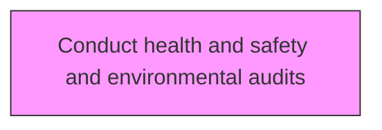
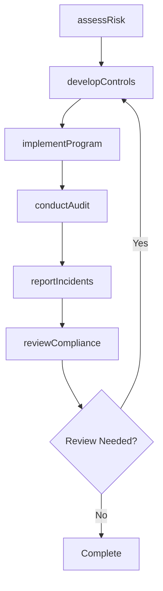

# Conduct health and safety and environmental audits

> Business-as-Code definition for conduct health and safety and environmental audits. Models the process of conducting an inspection to verify that the organization adequately complies with the environmental, health, and safety standards.

## Overview

Conducting an inspection to verify that the organization adequately complies with the environmental, health, and safety standards. Audit procedures and records regarding responsibility for the environment, health, and safety.

## Process Hierarchy



## GraphDL

```yaml
conduct:
  object: Health And Safety And Environmental Audits
  actor: EHSManager
  result: healthAndSafetyAndEnvironmentalAuditsResult
```

## Actions

| Action | Description |
|--------|-------------|
| assessRisk | Evaluate environmental health and safety risks for health and safety and environmental audits |
| developControls | Design preventive controls and procedures for health and safety and environmental audits |
| implementProgram | Deploy the EHS program elements for health and safety and environmental audits |
| conductAudit | Perform compliance audit for health and safety and environmental audits |
| reportIncidents | Document and report incidents related to health and safety and environmental audits |
| reviewCompliance | Verify regulatory compliance for health and safety and environmental audits |

## Events

| Event | Description |
|-------|-------------|
| risksAssessed | Environmental health and safety risks evaluated and documented |
| controlsDeveloped | Preventive controls and audit procedures designed and approved |
| programImplemented | EHS audit program elements deployed across applicable facilities |
| auditConducted | Compliance audit performed and findings recorded |
| incidentsReported | Audit-related incidents documented and reported to stakeholders |
| complianceReviewed | Regulatory compliance verification completed with results |

## Searches

| Search | Description |
|--------|-------------|
| findHealthAndSafetyAndEnvironmentalAudits | Retrieve health and safety and environmental audits records filtered by status, date, or scope |
| getHealthAndSafetyAndEnvironmentalAuditsDetails | Get detailed information for a specific health and safety and environmental audits record |
| listHealthAndSafetyAndEnvironmentalAuditsHistory | Query the history of changes and updates to health and safety and environmental audits |
| getActiveItems | List currently active items related to health and safety and environmental audits |

## Process Flow



## RACI Matrix

| Activity | Responsible | Accountable | Consulted | Informed |
|----------|-------------|-------------|-----------|----------|
| assessRisk | SafetyOfficer | EHSManager | Operations | Stakeholders |
| developControls | EnvironmentalSpecialist | EHSManager | RegulatoryAffairs | Stakeholders |
| implementProgram | EHSManager | VPOperations | Legal | Stakeholders |
| conductAudit | SafetyOfficer | EHSManager | HumanResources | Stakeholders |

## Related Processes

| Process | Relationship |
|---------|-------------|
| 13.7.1 Determine environmental health and safety impacts | Upstream - impact assessment informs EHS programs |
| 13.7.2 Develop and execute functional EHS program | Parallel - program development and execution |
| 13.7.4 Monitor and manage functional EHS management program | Downstream - ongoing monitoring and management |

## Related Departments

| Department | Role |
|-----------|------|
| Environment Health and Safety | Primary owner of EHS programs and compliance |
| Operations | Implements EHS requirements in operational activities |
| Legal | Advises on regulatory compliance and liability management |
| Human Resources | Supports EHS training and employee wellness programs |

## Related Occupations

| Occupation | Involvement |
|-----------|-------------|
| EHS Manager | Leads environmental health and safety programs |
| Safety Officer | Monitors workplace safety and incident response |
| Environmental Specialist | Manages environmental compliance and reporting |

## KPIs

| KPI | Description | Unit |
|-----|-------------|------|
| Incident Rate | Number of recordable incidents per 200,000 hours worked | Rate |
| Compliance Rate | Percentage compliance with EHS regulatory requirements | % |
| Training Completion | Percentage of employees completing required EHS training | % |
| Near Miss Reporting Rate | Number of near misses reported per period | Count |

## Usage

```typescript
import { conductHealthAndSafetyAndEnvironmentalAudits } from '@headlessly/conduct-health-and-safety-and-environmental-audits'

const client = conductHealthAndSafetyAndEnvironmentalAudits()

// Evaluate environmental health and safety risks for health and safety and environmental audits
const result = await client.assessRisk({
  scope: 'enterprise',
  period: 'Q1-2025'
})

// Design preventive controls and procedures for health and safety and environmental audits
const assessment = await client.developControls({
  resultId: result.id,
  criteria: 'standard'
})

// Deploy the EHS program elements for health and safety and environmental audits
await client.implementProgram({
  resultId: result.id,
  format: 'detailed',
  recipients: ['stakeholders']
})
```
