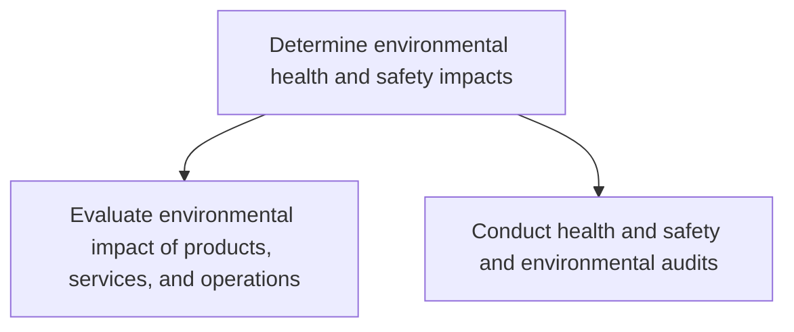
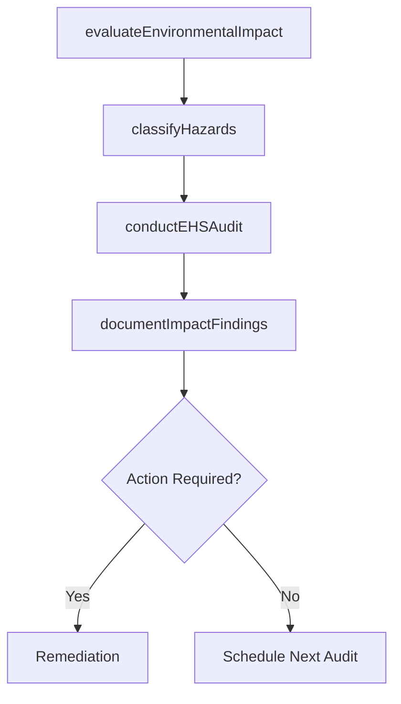

# Determine environmental health and safety impacts

> Business-as-Code definition for EHS impact determination. Models the evaluation of environmental impact from products, services, and operations, and the execution of health, safety, and environmental compliance audits.

## Overview

Determining the impact of EHS offering--and the procedures it employs to process them--on the environment at large, as well as the health and safety of employees. Evaluate the environmental impact of the organization's products, services, and operations. Conduct health, safety, and environmental audits.

## Process Hierarchy



## GraphDL

```yaml
determine:
  object: Environmental Health And Safety Impacts
  actor: EHSEngineer
  result: EHSImpactAssessment
```

## Actions

| Action | Description |
|--------|-------------|
| evaluateEnvironmentalImpact | Assess the environmental footprint of products, services, and operations |
| conductEHSAudit | Perform health, safety, and environmental compliance audits across facilities |
| classifyHazards | Identify and categorize workplace hazards and environmental risks |
| documentImpactFindings | Record assessment and audit findings with severity classifications |

## Events

| Event | Description |
|-------|-------------|
| environmentalImpactEvaluated | Environmental impact assessment completed for a facility or product line |
| ehsAuditConducted | EHS compliance audit completed with findings documented |
| hazardsClassified | Workplace hazards and environmental risks categorized |
| impactFindingsDocumented | Assessment findings recorded and distributed to stakeholders |

## Searches

| Search | Description |
|--------|-------------|
| findImpactAssessments | List environmental impact assessments by facility, product, or date |
| getAuditResults | Retrieve EHS audit findings by facility or compliance area |
| findHazards | List classified hazards by type, severity, or location |

## Process Flow



## RACI Matrix

| Activity | Responsible | Accountable | Consulted | Informed |
|----------|-------------|-------------|-----------|----------|
| evaluateEnvironmentalImpact | EnvironmentalSpecialist | EHSManager | Operations | Regulatory |
| conductEHSAudit | EHSAuditor | EHSManager | FacilityManagers | Legal |
| classifyHazards | SafetyEngineer | EHSManager | HR | AllEmployees |

## Sub-Processes

| ID | Name | Description |
|----|------|-------------|
| 13.7.1.1 | Evaluate environmental impact of products, services, and operations | Evaluating the impact of offerings and the auxiliary operations required to process them on the imme |
| 13.7.1.2 | Conduct health and safety and environmental audits | Conducting an inspection to verify that the organization adequately complies with the environmental, |

## Related Processes

| Process | Relationship |
|---------|-------------|
| 13.7.2 Develop and execute functional EHS program | Downstream - impact findings inform EHS program design |
| 13.7.4 Monitor and manage functional EHS management program | Downstream - assessment data feeds ongoing EHS monitoring |

## Related Departments

| Department | Role |
|-----------|------|
| Environment, Health and Safety | Primary owner of impact assessment and auditing |
| Operations | Provides access to facilities and operational data |
| Legal | Advises on regulatory compliance requirements |

## Related Occupations

| Occupation | Involvement |
|-----------|-------------|
| Environmental Specialist | Conducts environmental impact evaluations |
| Safety Engineer | Classifies hazards and assesses workplace safety |
| EHS Auditor | Performs compliance audits across facilities |

## KPIs

| KPI | Description | Unit |
|-----|-------------|------|
| Audit Completion Rate | Percentage of scheduled EHS audits completed on time | % |
| Finding Severity Distribution | Distribution of audit findings by severity level | % |
| Impact Assessment Coverage | Percentage of facilities with current impact assessments | % |

## Usage

```typescript
import { determineEHSImpacts } from '@headlessly/determine-environmental-health-and-safety-impacts'

const impacts = determineEHSImpacts()

// Evaluate environmental impact of a manufacturing facility
const assessment = await impacts.evaluateEnvironmentalImpact({
  facilityId: 'FAC-0032',
  scope: ['emissions', 'waste', 'water-usage', 'energy-consumption'],
  regulatoryFramework: 'EPA'
})

// Conduct a compliance audit
const audit = await impacts.conductEHSAudit({
  facilityId: 'FAC-0032',
  auditType: 'comprehensive',
  standards: ['OSHA', 'ISO-14001']
})
```
