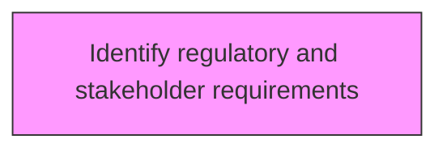
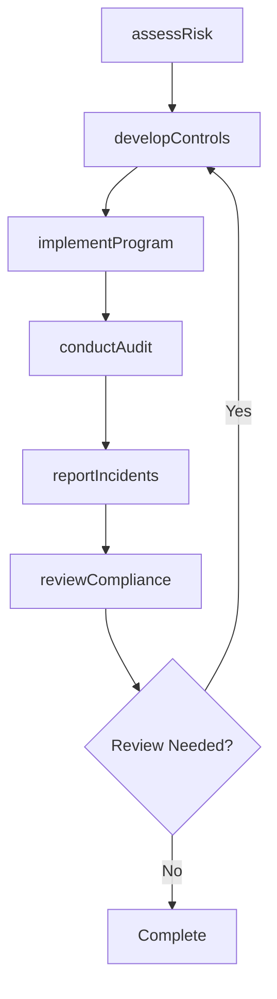

# Identify regulatory and stakeholder requirements

> Business-as-Code definition for identify regulatory and stakeholder requirements. Models the process of determining any protocols or standards to comply with, set by regulatory agencies or the organization's stakeholders.

## Overview

Determining any protocols or standards to comply with, set by regulatory agencies or the organization's stakeholders. Closely examine all standards and matters of compliance relating to the environment, health, and safety.

## Process Hierarchy



## GraphDL

```yaml
identify:
  object: Regulatory And Stakeholder Requirements
  actor: EHSManager
  result: regulatoryAndStakeholderRequirementsResult
```

## Actions

| Action | Description |
|--------|-------------|
| assessRisk | Evaluate environmental health and safety risks for regulatory and stakeholder requirements |
| developControls | Design preventive controls and procedures for regulatory and stakeholder requirements |
| implementProgram | Deploy the EHS program elements for regulatory and stakeholder requirements |
| conductAudit | Perform compliance audit for regulatory and stakeholder requirements |
| reportIncidents | Document and report incidents related to regulatory and stakeholder requirements |
| reviewCompliance | Verify regulatory compliance for regulatory and stakeholder requirements |

## Events

| Event | Description |
|-------|-------------|
| riskAssessed | Environmental health and safety risks evaluated |
| controlsDeveloped | Preventive controls and procedures designed |
| programImplemented | EHS program elements deployed |
| auditConducted | Compliance audit performed |
| incidentsReported | Incidents documented and reported |
| complianceReviewed | Regulatory compliance verified |

## Searches

| Search | Description |
|--------|-------------|
| findRegulatoryAndStakeholderRequirements | Retrieve regulatory and stakeholder requirements records filtered by status, date, or scope |
| getRegulatoryAndStakeholderRequirementsDetails | Get detailed information for a specific regulatory and stakeholder requirements record |
| listRegulatoryAndStakeholderRequirementsHistory | Query the history of changes and updates to regulatory and stakeholder requirements |
| getActiveItems | List currently active items related to regulatory and stakeholder requirements |

## Process Flow



## RACI Matrix

| Activity | Responsible | Accountable | Consulted | Informed |
|----------|-------------|-------------|-----------|----------|
| assessRisk | SafetyOfficer | EHSManager | Operations | Stakeholders |
| developControls | EnvironmentalSpecialist | EHSManager | RegulatoryAffairs | Stakeholders |
| implementProgram | EHSManager | VPOperations | Legal | Stakeholders |
| conductAudit | SafetyOfficer | EHSManager | HumanResources | Stakeholders |

## Related Processes

| Process | Relationship |
|---------|-------------|
| 13.7.1 Determine environmental health and safety impacts | Upstream - impact assessment informs EHS programs |
| 13.7.2 Develop and execute functional EHS program | Parallel - program development and execution |
| 13.7.4 Monitor and manage functional EHS management program | Downstream - ongoing monitoring and management |

## Related Departments

| Department | Role |
|-----------|------|
| Environment Health and Safety | Primary owner of EHS programs and compliance |
| Operations | Implements EHS requirements in operational activities |
| Legal | Advises on regulatory compliance and liability management |
| Human Resources | Supports EHS training and employee wellness programs |

## Related Occupations

| Occupation | Involvement |
|-----------|-------------|
| EHS Manager | Leads environmental health and safety programs |
| Safety Officer | Monitors workplace safety and incident response |
| Environmental Specialist | Manages environmental compliance and reporting |

## KPIs

| KPI | Description | Unit |
|-----|-------------|------|
| Incident Rate | Number of recordable incidents per 200,000 hours worked | Rate |
| Compliance Rate | Percentage compliance with EHS regulatory requirements | % |
| Training Completion | Percentage of employees completing required EHS training | % |
| Near Miss Reporting Rate | Number of near misses reported per period | Count |

## Usage

```typescript
import { identifyRegulatoryAndStakeholderRequirements } from '@headlessly/identify-regulatory-and-stakeholder-requirements'

const client = identifyRegulatoryAndStakeholderRequirements()

// Evaluate environmental health and safety risks for regulatory and stakeholder requirements
const result = await client.assessRisk({
  scope: 'enterprise',
  period: 'Q1-2025'
})

// Design preventive controls and procedures for regulatory and stakeholder requirements
const assessment = await client.developControls({
  resultId: result.id,
  criteria: 'standard'
})

// Deploy the EHS program elements for regulatory and stakeholder requirements
await client.implementProgram({
  resultId: result.id,
  format: 'detailed',
  recipients: ['stakeholders']
})
```
