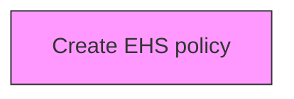
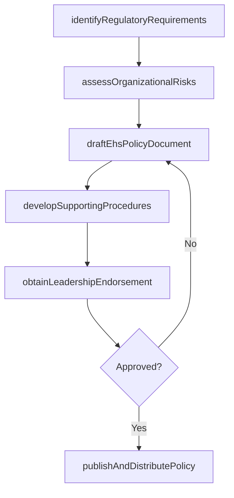

# Create EHS policy

> Business-as-Code definition for create ehs policy. Models the process of creating a plan for managing the environmental, health, and safety impact of products/services.

## Overview

Creating a plan for managing the environmental, health, and safety impact of products/services. Establish minimum requirements for the organization regarding the environment at large and the health and safety of employees. Develop policies, written procedures, and supporting tools to dictate how the organization will meet policy requirements.

## Process Hierarchy



## GraphDL

```yaml
create:
  object: EHS Policy
  actor: EHSManager
  result: EhsPolicyDocument
```

## Actions

| Action | Description |
|--------|-------------|
| identifyRegulatoryRequirements | Survey applicable environmental, health, and safety regulations at federal, state, and local levels |
| assessOrganizationalRisks | Evaluate workplace hazards, environmental impacts, and operational safety risks across all facilities |
| draftEhsPolicyDocument | Author the formal EHS policy establishing minimum requirements, responsibilities, and commitments |
| developSupportingProcedures | Create detailed written procedures and operational controls to meet each policy requirement |
| obtainLeadershipEndorsement | Present the EHS policy to senior leadership for formal approval and commitment |
| publishAndDistributePolicy | Distribute the approved EHS policy to all employees and post in required locations |

## Events

| Event | Description |
|-------|-------------|
| regulatoryRequirementsIdentified | Applicable environmental, health, and safety regulations surveyed and cataloged |
| organizationalRisksAssessed | Workplace hazards and environmental impacts evaluated across all facilities |
| ehsPolicyDocumentDrafted | Formal EHS policy document authored with requirements and responsibilities |
| supportingProceduresDeveloped | Detailed operational procedures and controls created for each policy requirement |
| leadershipEndorsementObtained | Senior leadership formally approved and endorsed the EHS policy |
| policyPublishedAndDistributed | Approved EHS policy distributed to all employees and posted in required locations |

## Searches

| Search | Description |
|--------|-------------|
| getActiveEhsPolicies | Retrieve current EHS policies filtered by facility, jurisdiction, or topic area |
| getRegulatoryRequirements | List applicable regulations by jurisdiction and compliance status |
| getEhsPolicyVersionHistory | Query the revision history and changelog for a specific EHS policy |
| findPoliciesDueForReview | List EHS policies approaching or past their scheduled review date |

## Process Flow



## RACI Matrix

| Activity | Responsible | Accountable | Consulted | Informed |
|----------|-------------|-------------|-----------|----------|
| identifyRegulatoryRequirements | EnvironmentalSpecialist | EHSManager | Legal | Operations |
| assessOrganizationalRisks | SafetyOfficer | EHSManager | FacilityManagers | HR |
| draftEhsPolicyDocument | EHSManager | VP Operations | Legal | ExecutiveTeam |
| publishAndDistributePolicy | EHSManager | VP Operations | Communications | AllEmployees |

## Related Processes

| Process | Relationship |
|---------|-------------|
| 13.7.1 Determine environmental health and safety impacts | Upstream - impact assessment informs EHS programs |
| 13.7.2 Develop and execute functional EHS program | Parallel - program development and execution |
| 13.7.4 Monitor and manage functional EHS management program | Downstream - ongoing monitoring and management |

## Related Departments

| Department | Role |
|-----------|------|
| Environment Health and Safety | Primary owner of EHS programs and compliance |
| Operations | Implements EHS requirements in operational activities |
| Legal | Advises on regulatory compliance and liability management |
| Human Resources | Supports EHS training and employee wellness programs |

## Related Occupations

| Occupation | Involvement |
|-----------|-------------|
| EHS Manager | Leads environmental health and safety programs |
| Safety Officer | Monitors workplace safety and incident response |
| Environmental Specialist | Manages environmental compliance and reporting |

## KPIs

| KPI | Description | Unit |
|-----|-------------|------|
| Incident Rate | Number of recordable incidents per 200,000 hours worked | Rate |
| Compliance Rate | Percentage compliance with EHS regulatory requirements | % |
| Training Completion | Percentage of employees completing required EHS training | % |
| Near Miss Reporting Rate | Number of near misses reported per period | Count |

## Usage

```typescript
import { createEhsPolicy } from '@headlessly/create-ehs-policy'

const ehsPolicy = createEhsPolicy()

// Identify applicable regulations for all facilities
const regulations = await ehsPolicy.identifyRegulatoryRequirements({
  jurisdictions: ['OSHA-federal', 'EPA-federal', 'CA-state'],
  facilityTypes: ['manufacturing', 'warehouse', 'office'],
  includeUpcoming: true
})

// Assess organizational risks across facilities
const risks = await ehsPolicy.assessOrganizationalRisks({
  facilities: ['plant-chicago', 'plant-houston', 'dc-atlanta'],
  categories: ['chemical-exposure', 'ergonomic', 'fire', 'environmental-discharge'],
  methodology: 'HIRA'
})

// Draft the EHS policy document
const policy = await ehsPolicy.draftEhsPolicyDocument({
  regulatoryIds: regulations.map(r => r.id),
  riskAssessmentId: risks.id,
  scope: 'enterprise',
  reviewCycle: 'annual'
})
```
