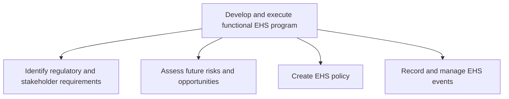
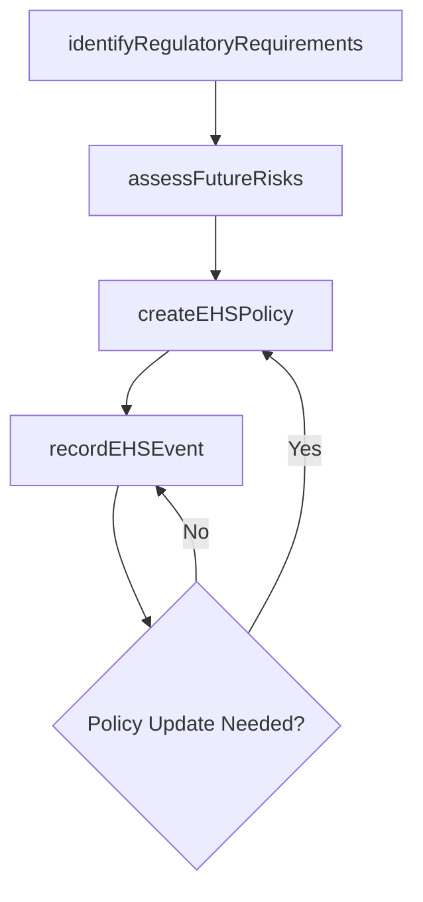

# Develop and execute functional EHS program

> Business-as-Code definition for EHS program development and execution. Models regulatory requirements identification, risk assessment, policy creation, and event management for environmental health and safety compliance.

## Overview

Identify the requirements for regulation and shareholders. Assess future risks and opportunities. Develop a policy for the EHS program. Record and manage EHS program events.

## Process Hierarchy



## GraphDL

```yaml
develop:
  object: And Execute Functional EHS Program
  actor: EHSManager
  result: EHSProgramPlan
```

## Actions

| Action | Description |
|--------|-------------|
| identifyRegulatoryRequirements | Determine applicable EHS regulations and stakeholder expectations |
| assessFutureRisks | Evaluate emerging EHS risks and opportunities |
| createEHSPolicy | Develop formal EHS policies aligned with regulatory requirements |
| recordEHSEvent | Log and classify EHS events including incidents and near-misses |

## Events

| Event | Description |
|-------|-------------|
| regulatoryRequirementsIdentified | Applicable regulations and stakeholder requirements cataloged |
| futureRisksAssessed | Emerging EHS risks and opportunities evaluated |
| ehsPolicyCreated | EHS policy approved and published |
| ehsEventRecorded | EHS event logged and classified in the tracking system |

## Searches

| Search | Description |
|--------|-------------|
| getRegulatoryRequirements | List applicable regulations by jurisdiction or facility |
| getEHSPolicies | Retrieve current EHS policies by topic or facility |
| findEHSEvents | List EHS events by type, severity, or date |

## Process Flow



## RACI Matrix

| Activity | Responsible | Accountable | Consulted | Informed |
|----------|-------------|-------------|-----------|----------|
| identifyRegulatoryRequirements | EHSSpecialist | EHSManager | Legal | Operations |
| assessFutureRisks | EHSEngineer | EHSManager | RiskManagement | Executive |
| createEHSPolicy | EHSManager | VP Operations | Legal | AllEmployees |

## Sub-Processes

| ID | Name | Description |
|----|------|-------------|
| 13.7.2.1 | Identify regulatory and stakeholder requirements | Determining any protocols or standards to comply with, set by regulatory agencies or the organizatio |
| 13.7.2.2 | Assess future risks and opportunities | Evaluating any risks and opportunities that might affect the environmental, health, and safety of pr |
| 13.7.2.3 | Create EHS policy | Creating a plan for managing the environmental, health, and safety impact of products/services. Esta |
| 13.7.2.4 | Record and manage EHS events | Recording and managing all events and activities associated with complying with environmental, healt |

## Related Processes

| Process | Relationship |
|---------|-------------|
| 13.7.1 Determine EHS impacts | Upstream - impact assessments inform program design |
| 13.7.3 Train and educate functional employees | Downstream - policies drive training requirements |
| 13.7.4 Monitor and manage functional EHS management program | Downstream - program feeds ongoing monitoring |

## Related Departments

| Department | Role |
|-----------|------|
| Environment, Health and Safety | Primary owner of EHS program development |
| Legal | Advises on regulatory compliance requirements |
| Risk Management | Provides enterprise risk assessment perspective |
| Operations | Implements EHS policies in daily operations |

## Related Occupations

| Occupation | Involvement |
|-----------|-------------|
| EHS Manager | Leads program development and policy creation |
| Regulatory Compliance Specialist | Tracks regulatory requirements and changes |
| Safety Engineer | Assesses risks and designs safety controls |

## KPIs

| KPI | Description | Unit |
|-----|-------------|------|
| Regulatory Compliance Rate | Percentage of applicable regulations with documented compliance | % |
| Policy Currency | Percentage of EHS policies reviewed within their revision cycle | % |
| Event Reporting Timeliness | Average time from EHS event occurrence to system recording | Hours |

## Usage

```typescript
import { developAndExecuteEHSProgram } from '@headlessly/develop-and-execute-functional-ehs-program'

const ehsProgram = developAndExecuteEHSProgram()

// Identify regulatory requirements for a new facility
const regs = await ehsProgram.identifyRegulatoryRequirements({
  facilityId: 'FAC-0045',
  jurisdiction: 'California',
  industryType: 'manufacturing'
})

// Create an EHS policy
const policy = await ehsProgram.createEHSPolicy({
  topic: 'hazardous-materials-handling',
  applicableRegulations: regs.ids,
  scope: 'all-manufacturing-facilities'
})
```
