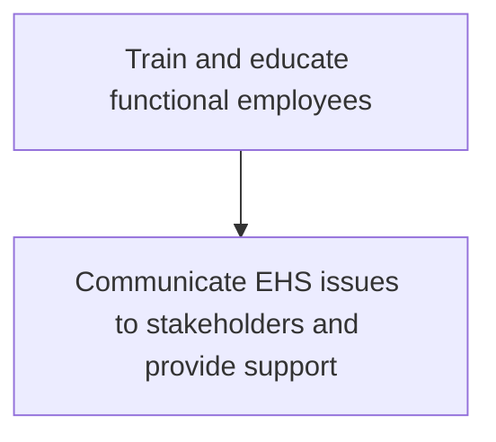
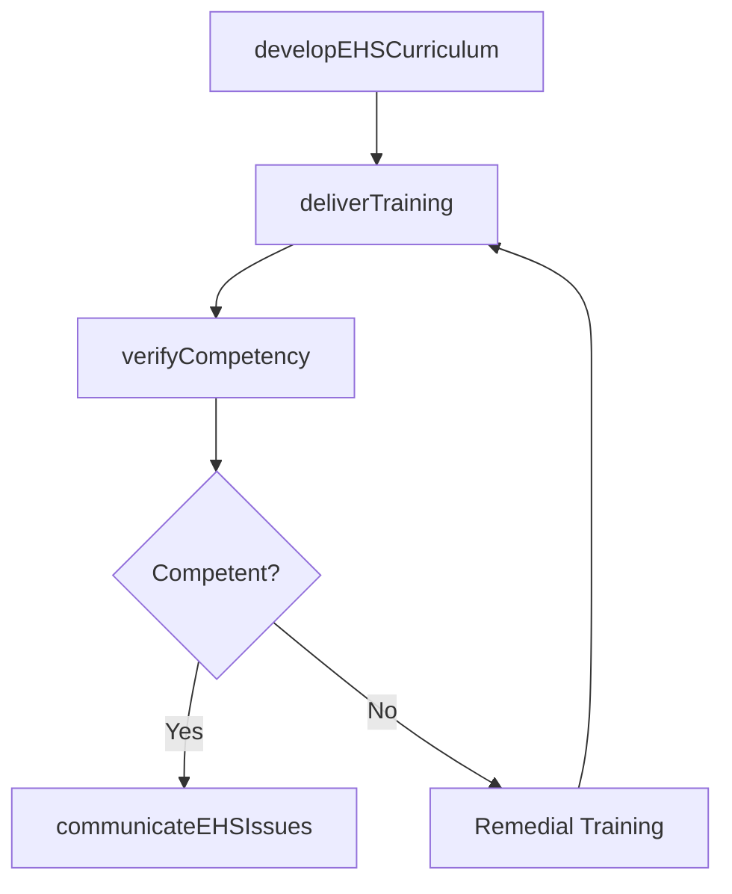

# Train and educate functional employees

> Business-as-Code definition for EHS employee training and education. Models the delivery of safety training programs, communication of EHS issues to stakeholders, and verification of workforce competency in health and safety procedures.

## Overview

Conducting programs such as on-the-job training sessions, group training workshops, and online training.

## Process Hierarchy



## GraphDL

```yaml
train:
  object: And Educate Functional Employees
  actor: EHSTrainer
  result: TrainingCompletionRecord
```

## Actions

| Action | Description |
|--------|-------------|
| developEHSCurriculum | Design training programs covering safety procedures, hazard recognition, and emergency response |
| deliverTraining | Conduct on-the-job, classroom, and online EHS training sessions |
| communicateEHSIssues | Report EHS issues and updates to stakeholders through appropriate channels |
| verifyCompetency | Assess employee knowledge and skills through tests and practical evaluations |

## Events

| Event | Description |
|-------|-------------|
| ehsCurriculumDeveloped | EHS training curriculum designed and approved |
| trainingDelivered | EHS training session completed with attendance recorded |
| ehsIssuesCommunicated | EHS updates and issues communicated to stakeholders |
| competencyVerified | Employee EHS competency assessment completed |

## Searches

| Search | Description |
|--------|-------------|
| findTrainingRecords | List EHS training completion records by employee, course, or date |
| getTrainingSchedule | Retrieve upcoming EHS training sessions and enrollment status |
| findOverdueTraining | List employees with expired or overdue EHS certifications |

## Process Flow



## RACI Matrix

| Activity | Responsible | Accountable | Consulted | Informed |
|----------|-------------|-------------|-----------|----------|
| developEHSCurriculum | EHSTrainer | EHSManager | HR | Operations |
| deliverTraining | EHSTrainer | EHSManager | FacilityManagers | AllEmployees |
| communicateEHSIssues | EHSManager | VP Operations | Communications | Stakeholders |

## Sub-Processes

| ID | Name | Description |
|----|------|-------------|
| 13.7.3.1 | Communicate EHS issues to stakeholders and provide support | Reporting any issues or problems with EHS to the stakeholders. This includes management, creditors,  |

## Related Processes

| Process | Relationship |
|---------|-------------|
| 13.7.2 Develop and execute functional EHS program | Upstream - EHS policies define training requirements |
| 13.7.4 Monitor and manage functional EHS management program | Downstream - training completion feeds EHS program monitoring |

## Related Departments

| Department | Role |
|-----------|------|
| Environment, Health and Safety | Primary owner of EHS training program |
| Human Resources | Manages training records and compliance tracking |
| Operations | Provides access to employees and work environments for training |

## Related Occupations

| Occupation | Involvement |
|-----------|-------------|
| EHS Trainer | Develops and delivers EHS training programs |
| Safety Coordinator | Tracks training compliance and schedules sessions |

## KPIs

| KPI | Description | Unit |
|-----|-------------|------|
| Training Completion Rate | Percentage of employees current on required EHS training | % |
| Competency Pass Rate | Percentage of employees passing competency assessments on first attempt | % |
| Training Overdue Rate | Percentage of employees with expired EHS certifications | % |

## Usage

```typescript
import { trainAndEducateEmployees } from '@headlessly/train-and-educate-functional-employees'

const training = trainAndEducateEmployees()

// Deliver EHS training to a facility
const session = await training.deliverTraining({
  courseId: 'EHS-hazmat-handling',
  facilityId: 'FAC-0032',
  format: 'classroom',
  attendees: ['team-warehouse-b']
})

// Verify employee competency
const assessment = await training.verifyCompetency({
  employeeId: 'EMP-4421',
  courseId: 'EHS-hazmat-handling',
  assessmentType: 'practical-evaluation'
})
```
