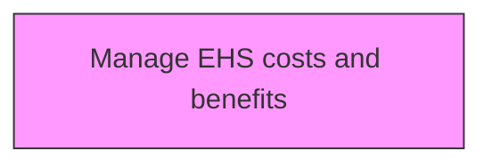
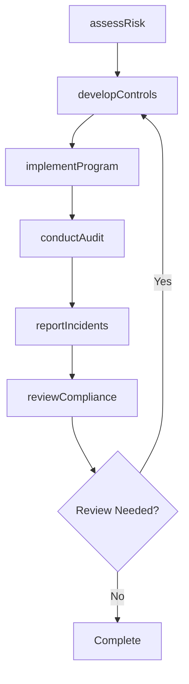

# Manage EHS costs and benefits

> Business-as-Code definition for manage ehs costs and benefits. Models the process of administering the costs and benefits of ehs management program.

## Overview

Administering the costs and benefits of EHS management program. Evaluate program costs to ensure that the benefits of the program always outweigh its costs.

## Process Hierarchy



## GraphDL

```yaml
manage:
  object: EHS Costs And Benefits
  actor: EHSManager
  result: ehsCostsAndBenefitsResult
```

## Actions

| Action | Description |
|--------|-------------|
| assessRisk | Evaluate environmental health and safety risks for ehs costs and benefits |
| developControls | Design preventive controls and procedures for ehs costs and benefits |
| implementProgram | Deploy the EHS program elements for ehs costs and benefits |
| conductAudit | Perform compliance audit for ehs costs and benefits |
| reportIncidents | Document and report incidents related to ehs costs and benefits |
| reviewCompliance | Verify regulatory compliance for ehs costs and benefits |

## Events

| Event | Description |
|-------|-------------|
| riskAssessed | Environmental health and safety risks evaluated |
| controlsDeveloped | Preventive controls and procedures designed |
| programImplemented | EHS program elements deployed |
| auditConducted | Compliance audit performed |
| incidentsReported | Incidents documented and reported |
| complianceReviewed | Regulatory compliance verified |

## Searches

| Search | Description |
|--------|-------------|
| findEhsCostsAndBenefits | Retrieve ehs costs and benefits records filtered by status, date, or scope |
| getEhsCostsAndBenefitsDetails | Get detailed information for a specific ehs costs and benefits record |
| listEhsCostsAndBenefitsHistory | Query the history of changes and updates to ehs costs and benefits |
| getActiveItems | List currently active items related to ehs costs and benefits |

## Process Flow



## RACI Matrix

| Activity | Responsible | Accountable | Consulted | Informed |
|----------|-------------|-------------|-----------|----------|
| assessRisk | SafetyOfficer | EHSManager | Operations | Stakeholders |
| developControls | EnvironmentalSpecialist | EHSManager | RegulatoryAffairs | Stakeholders |
| implementProgram | EHSManager | VPOperations | Legal | Stakeholders |
| conductAudit | SafetyOfficer | EHSManager | HumanResources | Stakeholders |

## Related Processes

| Process | Relationship |
|---------|-------------|
| 13.7.1 Determine environmental health and safety impacts | Upstream - impact assessment informs EHS programs |
| 13.7.2 Develop and execute functional EHS program | Parallel - program development and execution |
| 13.7.4 Monitor and manage functional EHS management program | Downstream - ongoing monitoring and management |

## Related Departments

| Department | Role |
|-----------|------|
| Environment Health and Safety | Primary owner of EHS programs and compliance |
| Operations | Implements EHS requirements in operational activities |
| Legal | Advises on regulatory compliance and liability management |
| Human Resources | Supports EHS training and employee wellness programs |

## Related Occupations

| Occupation | Involvement |
|-----------|-------------|
| EHS Manager | Leads environmental health and safety programs |
| Safety Officer | Monitors workplace safety and incident response |
| Environmental Specialist | Manages environmental compliance and reporting |

## KPIs

| KPI | Description | Unit |
|-----|-------------|------|
| Incident Rate | Number of recordable incidents per 200,000 hours worked | Rate |
| Compliance Rate | Percentage compliance with EHS regulatory requirements | % |
| Training Completion | Percentage of employees completing required EHS training | % |
| Near Miss Reporting Rate | Number of near misses reported per period | Count |

## Usage

```typescript
import { manageEhsCostsAndBenefits } from '@headlessly/manage-ehs-costs-and-benefits'

const client = manageEhsCostsAndBenefits()

// Evaluate environmental health and safety risks for ehs costs and benefits
const result = await client.assessRisk({
  scope: 'enterprise',
  period: 'Q1-2025'
})

// Design preventive controls and procedures for ehs costs and benefits
const assessment = await client.developControls({
  resultId: result.id,
  criteria: 'standard'
})

// Deploy the EHS program elements for ehs costs and benefits
await client.implementProgram({
  resultId: result.id,
  format: 'detailed',
  recipients: ['stakeholders']
})
```
