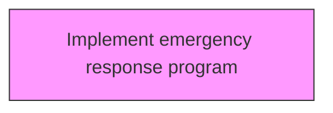
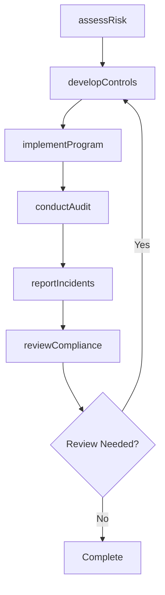

# Implement emergency response program

> Business-as-Code definition for implement emergency response program. Models the process of implementing a program for organizing, coordinating, and directing available resources to respond to the event.

## Overview

Implementing a program for organizing, coordinating, and directing available resources to respond to the event. Conduct a risk assessment to identify potential emergency scenarios in order to create a program that ensures that resources are on hand--or quickly available--in case of emergencies.

## Process Hierarchy



## GraphDL

```yaml
implement:
  object: Emergency Response Program
  actor: EHSManager
  result: emergencyResponseProgramResult
```

## Actions

| Action | Description |
|--------|-------------|
| assessRisk | Evaluate environmental health and safety risks for emergency response program |
| developControls | Design preventive controls and procedures for emergency response program |
| implementProgram | Deploy the EHS program elements for emergency response program |
| conductAudit | Perform compliance audit for emergency response program |
| reportIncidents | Document and report incidents related to emergency response program |
| reviewCompliance | Verify regulatory compliance for emergency response program |

## Events

| Event | Description |
|-------|-------------|
| risksAssessed | Emergency scenario risks evaluated and documented |
| controlsDeveloped | Preventive controls and emergency response procedures designed |
| programImplemented | Emergency response program elements deployed to all facilities |
| auditConducted | Emergency response program compliance audit performed |
| incidentsReported | Emergency events documented and reported to stakeholders and regulators |
| complianceReviewed | Regulatory compliance of the emergency response program verified |

## Searches

| Search | Description |
|--------|-------------|
| findEmergencyResponseProgram | Retrieve emergency response program records filtered by status, date, or scope |
| getEmergencyResponseProgramDetails | Get detailed information for a specific emergency response program record |
| listEmergencyResponseProgramHistory | Query the history of changes and updates to emergency response program |
| getActiveItems | List currently active items related to emergency response program |

## Process Flow



## RACI Matrix

| Activity | Responsible | Accountable | Consulted | Informed |
|----------|-------------|-------------|-----------|----------|
| assessRisk | SafetyOfficer | EHSManager | Operations | Stakeholders |
| developControls | EnvironmentalSpecialist | EHSManager | RegulatoryAffairs | Stakeholders |
| implementProgram | EHSManager | VPOperations | Legal | Stakeholders |
| conductAudit | SafetyOfficer | EHSManager | HumanResources | Stakeholders |

## Related Processes

| Process | Relationship |
|---------|-------------|
| 13.7.1 Determine environmental health and safety impacts | Upstream - impact assessment informs EHS programs |
| 13.7.2 Develop and execute functional EHS program | Parallel - program development and execution |
| 13.7.4 Monitor and manage functional EHS management program | Downstream - ongoing monitoring and management |

## Related Departments

| Department | Role |
|-----------|------|
| Environment Health and Safety | Primary owner of EHS programs and compliance |
| Operations | Implements EHS requirements in operational activities |
| Legal | Advises on regulatory compliance and liability management |
| Human Resources | Supports EHS training and employee wellness programs |

## Related Occupations

| Occupation | Involvement |
|-----------|-------------|
| EHS Manager | Leads environmental health and safety programs |
| Safety Officer | Monitors workplace safety and incident response |
| Environmental Specialist | Manages environmental compliance and reporting |

## KPIs

| KPI | Description | Unit |
|-----|-------------|------|
| Incident Rate | Number of recordable incidents per 200,000 hours worked | Rate |
| Compliance Rate | Percentage compliance with EHS regulatory requirements | % |
| Training Completion | Percentage of employees completing required EHS training | % |
| Near Miss Reporting Rate | Number of near misses reported per period | Count |

## Usage

```typescript
import { implementEmergencyResponseProgram } from '@headlessly/implement-emergency-response-program'

const client = implementEmergencyResponseProgram()

// Evaluate environmental health and safety risks for emergency response program
const result = await client.assessRisk({
  scope: 'enterprise',
  period: 'Q1-2025'
})

// Design preventive controls and procedures for emergency response program
const assessment = await client.developControls({
  resultId: result.id,
  criteria: 'standard'
})

// Deploy the EHS program elements for emergency response program
await client.implementProgram({
  resultId: result.id,
  format: 'detailed',
  recipients: ['stakeholders']
})
```
