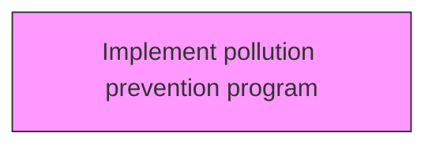
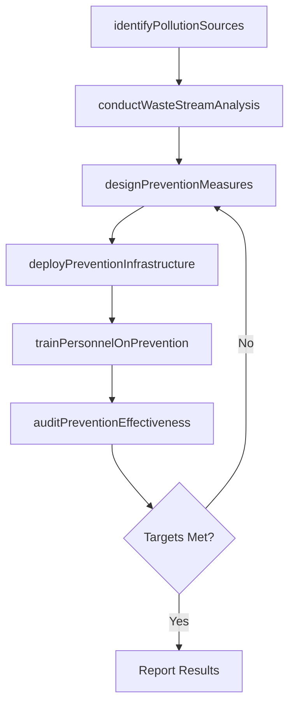

# Implement pollution prevention program

> Business-as-Code definition for implement pollution prevention program. Models the process of implementing a program that reduces or eliminates the creation of pollutants through increased efficiency in the use of raw materials, energy, water, or other resources.

## Overview

Implementing a program that reduces or eliminates the creation of pollutants through increased efficiency in the use of raw materials, energy, water, or other resources. Implement a program to inspect facilities that store, manufacture, or use hazardous, toxic, or polluting materials.

## Process Hierarchy



## GraphDL

```yaml
implement:
  object: Pollution Prevention Program
  actor: EHSManager
  result: pollutionPreventionProgramResult
```

## Actions

| Action | Description |
|--------|-------------|
| identifyPollutionSources | Survey facilities and processes to catalog emissions, discharges, and waste streams |
| conductWasteStreamAnalysis | Analyze material flows to identify opportunities for source reduction and recycling |
| designPreventionMeasures | Engineer process modifications, substitutions, and controls to reduce pollutant generation |
| deployPreventionInfrastructure | Install pollution control equipment, monitoring systems, and containment structures |
| trainPersonnelOnPrevention | Educate facility staff on pollution prevention procedures and spill response protocols |
| auditPreventionEffectiveness | Inspect facilities and verify that implemented measures are achieving reduction targets |

## Events

| Event | Description |
|-------|-------------|
| pollutionSourcesIdentified | Facility emissions, discharges, and waste streams cataloged |
| wasteStreamAnalysisCompleted | Material flow analysis finished with reduction opportunities documented |
| preventionMeasuresDesigned | Process modifications and controls designed and approved |
| preventionInfrastructureDeployed | Pollution control equipment and monitoring systems installed |
| personnelTrained | Facility staff completed pollution prevention and spill response training |
| preventionEffectivenessAudited | Audit completed verifying reduction targets are being achieved |

## Searches

| Search | Description |
|--------|-------------|
| findPollutionSources | List cataloged pollution sources by facility, process, or pollutant type |
| getEmissionsReductions | Retrieve measured reduction data by pollutant, facility, or reporting period |
| getPreventionMeasures | Query active prevention measures and their implementation status |
| getAuditFindings | Retrieve pollution prevention audit results and open corrective actions |

## Process Flow



## RACI Matrix

| Activity | Responsible | Accountable | Consulted | Informed |
|----------|-------------|-------------|-----------|----------|
| identifyPollutionSources | EnvironmentalEngineer | EHSManager | FacilityOperations | RegulatoryAffairs |
| conductWasteStreamAnalysis | EnvironmentalEngineer | EHSManager | ProcessEngineering | Finance |
| designPreventionMeasures | EnvironmentalEngineer | EHSManager | ProcessEngineering | Operations |
| deployPreventionInfrastructure | FacilitiesManager | EHSManager | EnvironmentalEngineer | Maintenance |
| trainPersonnelOnPrevention | EHSTrainer | EHSManager | OperationsSupervisors | HumanResources |
| auditPreventionEffectiveness | EHSAuditor | EHSManager | EnvironmentalEngineer | VPOperations |

## Related Processes

| Process | Relationship |
|---------|-------------|
| 13.7.1 Determine environmental health and safety impacts | Upstream - impact assessment informs EHS programs |
| 13.7.2 Develop and execute functional EHS program | Parallel - program development and execution |
| 13.7.4 Monitor and manage functional EHS management program | Downstream - ongoing monitoring and management |

## Related Departments

| Department | Role |
|-----------|------|
| Environment Health and Safety | Primary owner of EHS programs and compliance |
| Operations | Implements EHS requirements in operational activities |
| Legal | Advises on regulatory compliance and liability management |
| Human Resources | Supports EHS training and employee wellness programs |

## Related Occupations

| Occupation | Involvement |
|-----------|-------------|
| EHS Manager | Leads environmental health and safety programs |
| Safety Officer | Monitors workplace safety and incident response |
| Environmental Specialist | Manages environmental compliance and reporting |

## KPIs

| KPI | Description | Unit |
|-----|-------------|------|
| Pollutant Reduction Rate | Percentage reduction in emissions or discharges versus baseline year | % |
| Waste Diversion Rate | Percentage of waste diverted from landfill through recycling or reuse | % |
| Prevention Measure Compliance | Percentage of scheduled prevention activities completed on time | % |
| Spill Incident Rate | Number of reportable spill events per facility per year | Count |

## Usage

```typescript
import { implementPollutionPreventionProgram } from '@headlessly/implement-pollution-prevention-program'

const prevention = implementPollutionPreventionProgram()

// Identify pollution sources at a facility
const sources = await prevention.identifyPollutionSources({
  facilityId: 'plant-west-7',
  pollutantCategories: ['air-emissions', 'wastewater', 'solid-waste'],
  regulatoryFramework: 'EPA-RCRA'
})

// Conduct waste stream analysis
const analysis = await prevention.conductWasteStreamAnalysis({
  facilityId: 'plant-west-7',
  sourceIds: sources.map(s => s.id),
  baselineYear: 2024
})

// Audit effectiveness of deployed measures
const audit = await prevention.auditPreventionEffectiveness({
  facilityId: 'plant-west-7',
  auditType: 'semi-annual',
  reductionTarget: 0.15,
  complianceStandard: 'ISO-14001'
})
```
