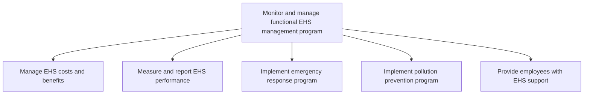
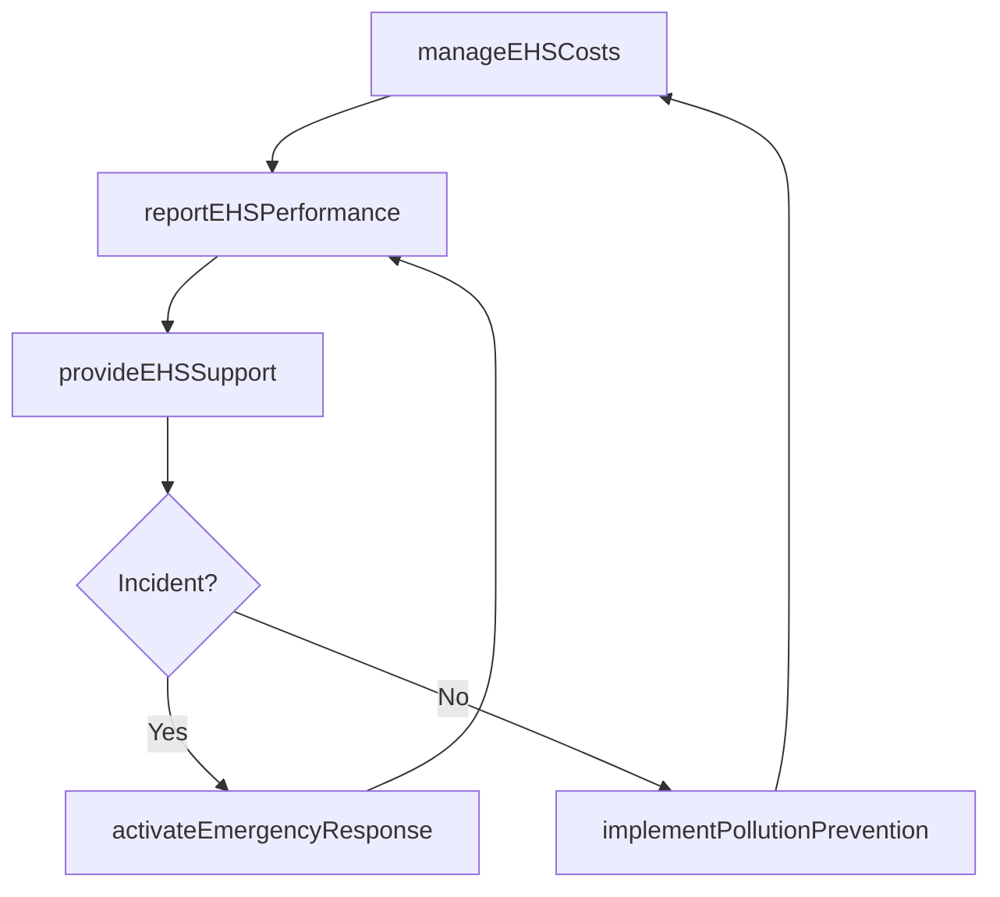

# Monitor and manage functional EHS management program

> Business-as-Code definition for EHS program monitoring and management. Models the ongoing management of EHS costs and benefits, performance reporting, emergency response, pollution prevention, and employee safety support.

## Overview

Managing the costs and benefits of EHS. Measure and report the performance of EHS. Implement plans for emergency response and pollution prevention. Provide EHS support.

## Process Hierarchy



## GraphDL

```yaml
monitor:
  object: And Manage Functional EHS Management Program
  actor: EHSManager
  result: EHSPerformanceReport
```

## Actions

| Action | Description |
|--------|-------------|
| manageEHSCosts | Track and optimize the costs and benefits of the EHS program |
| reportEHSPerformance | Generate EHS performance reports using safety and environmental metrics |
| activateEmergencyResponse | Implement emergency response protocols for EHS incidents |
| implementPollutionPrevention | Deploy pollution prevention programs for waste reduction and efficiency |
| provideEHSSupport | Deliver ongoing safety support and resources to employees |

## Events

| Event | Description |
|-------|-------------|
| ehsCostsManaged | EHS cost-benefit analysis completed and budget reviewed |
| ehsPerformanceReported | EHS performance report submitted to leadership and regulators |
| emergencyResponseActivated | Emergency response protocol initiated for an EHS incident |
| pollutionPreventionImplemented | Pollution prevention program deployed or updated |
| ehsSupportProvided | EHS support resources delivered to employees |

## Searches

| Search | Description |
|--------|-------------|
| getEHSPerformanceMetrics | Retrieve EHS safety and environmental metrics by facility or period |
| findEmergencyResponseEvents | List emergency response activations by type, facility, or date |
| getEHSCostData | Retrieve EHS program cost and benefit data |
| findPollutionPreventionPrograms | List active pollution prevention initiatives by facility |

## Process Flow



## RACI Matrix

| Activity | Responsible | Accountable | Consulted | Informed |
|----------|-------------|-------------|-----------|----------|
| manageEHSCosts | EHSAnalyst | EHSManager | Finance | VP Operations |
| reportEHSPerformance | EHSAnalyst | EHSManager | Regulatory | Board |
| activateEmergencyResponse | EmergencyCoordinator | EHSManager | FacilityManagers | AllEmployees |
| provideEHSSupport | EHSCoordinator | EHSManager | HR | LineManagers |

## Sub-Processes

| ID | Name | Description |
|----|------|-------------|
| 13.7.4.1 | Manage EHS costs and benefits | Administering the costs and benefits of EHS management program. Evaluate program costs to ensure tha |
| 13.7.4.2 | Measure and report EHS performance | Using performance techniques and indicators. Utilize number of audits or inspections performed, safe |
| 13.7.4.3 | Implement emergency response program | Implementing a program for organizing, coordinating, and directing available resources to respond to |
| 13.7.4.4 | Implement pollution prevention program | Implementing a program that reduces or eliminates the creation of pollutants through increased effic |
| 13.7.4.5 | Provide employees with EHS support | Supporting employees in light of the organization's environmental, health, and safety policies and s |

## Related Processes

| Process | Relationship |
|---------|-------------|
| 13.7.2 Develop and execute functional EHS program | Upstream - EHS program provides the policies being monitored |
| 13.7.3 Train and educate functional employees | Parallel - training compliance is a key monitoring dimension |
| 13.7.1 Determine EHS impacts | Upstream - impact assessments inform monitoring priorities |

## Related Departments

| Department | Role |
|-----------|------|
| Environment, Health and Safety | Primary owner of EHS monitoring and reporting |
| Operations | Implements emergency response and pollution prevention on the floor |
| Finance | Tracks EHS program costs and budget compliance |
| Facilities | Maintains physical infrastructure for safety compliance |

## Related Occupations

| Occupation | Involvement |
|-----------|-------------|
| EHS Manager | Oversees EHS program monitoring and performance reporting |
| Emergency Response Coordinator | Manages incident response protocols and drills |
| Environmental Specialist | Monitors pollution prevention program effectiveness |

## KPIs

| KPI | Description | Unit |
|-----|-------------|------|
| Total Recordable Incident Rate (TRIR) | Number of recordable incidents per 200,000 hours worked | Rate |
| Emergency Response Time | Average time from incident detection to response activation | Minutes |
| Pollution Prevention ROI | Return on investment from waste reduction and efficiency programs | % |
| EHS Cost Per Employee | Total EHS program cost divided by workforce size | Currency |

## Usage

```typescript
import { monitorAndManageEHSProgram } from '@headlessly/monitor-and-manage-functional-ehs-management-program'

const ehsMonitor = monitorAndManageEHSProgram()

// Report EHS performance for a facility
const report = await ehsMonitor.reportEHSPerformance({
  facilityId: 'FAC-0032',
  period: '2026-Q1',
  metrics: ['TRIR', 'lost-time-injuries', 'near-misses', 'training-compliance']
})

// Activate emergency response
const response = await ehsMonitor.activateEmergencyResponse({
  facilityId: 'FAC-0032',
  incidentType: 'chemical-spill',
  severity: 'high',
  location: 'production-line-3'
})
```
