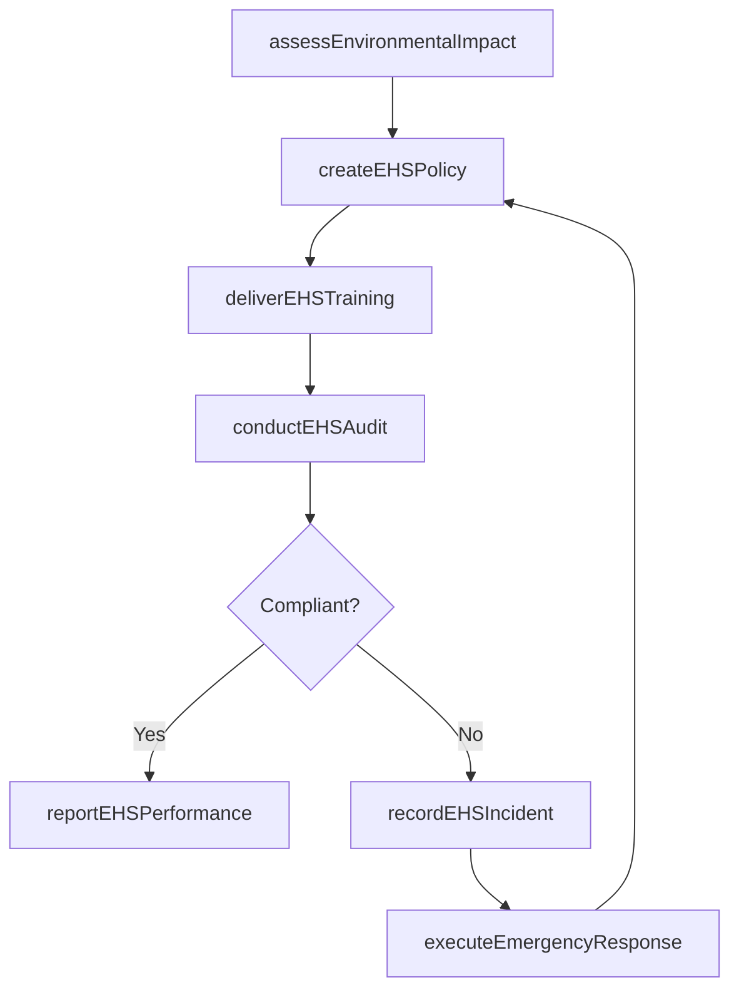

# Manage environmental health and safety (EHS)

> Business-as-Code definition for environmental health and safety management. Models the complete EHS lifecycle from impact assessment and regulatory compliance through program execution, employee training, and incident response.

## Overview

Determining the impacts of environmental health and safety. Create and implement the EHS program. Train and educate employees of the EHS function. Oversee and manage the EHS program.

## Process Hierarchy

```mermaid
graph TD
    A[Manage environmental health and safety (EHS)]
    A --> B[Determine environmental health and safety impacts]
    A --> C[Develop and execute functional EHS program]
    A --> D[Train and educate functional employees]
    A --> E[Monitor and manage functional EHS management program]
```

## GraphDL

```yaml
manage:
  object: Environmental Health And Safety (EHS)
  actor: EHSManager
  result: EHSComplianceReport
```

## Actions

| Action | Description |
|--------|-------------|
| assessEnvironmentalImpact | Evaluate the environmental impact of products, services, and operations |
| conductEHSAudit | Perform health, safety, and environmental compliance audits |
| createEHSPolicy | Develop EHS policies aligned with regulatory and stakeholder requirements |
| recordEHSIncident | Log and classify EHS events including near-misses and incidents |
| deliverEHSTraining | Conduct safety training sessions for employees and contractors |
| executeEmergencyResponse | Activate emergency response protocols for EHS incidents |
| reportEHSPerformance | Generate compliance and performance reports for regulators and leadership |

## Events

| Event | Description |
|-------|-------------|
| environmentalImpactAssessed | Environmental impact evaluation completed for a facility or product |
| ehsAuditConducted | EHS audit completed with findings and recommendations documented |
| ehsPolicyCreated | New or updated EHS policy approved and published |
| ehsIncidentRecorded | EHS incident or near-miss logged in the tracking system |
| ehsTrainingDelivered | Safety training session completed with attendance recorded |
| emergencyResponseExecuted | Emergency response protocol activated and incident managed |
| ehsPerformanceReported | EHS compliance and performance report submitted |

## Searches

| Search | Description |
|--------|-------------|
| findEHSIncidents | List incidents filtered by type, severity, location, or date range |
| getComplianceStatus | Retrieve current regulatory compliance status by facility or jurisdiction |
| getAuditFindings | List open audit findings by severity and remediation deadline |
| findTrainingRecords | Search employee EHS training completion records |
| getEHSMetrics | Retrieve safety and environmental performance metrics |

## Process Flow



## RACI Matrix

| Activity | Responsible | Accountable | Consulted | Informed |
|----------|-------------|-------------|-----------|----------|
| assessEnvironmentalImpact | EHSEngineer | EHSManager | Operations | RegulatoryAffairs |
| createEHSPolicy | EHSManager | VP Operations | Legal | AllEmployees |
| conductEHSAudit | EHSAuditor | EHSManager | FacilityManagers | Executive |
| deliverEHSTraining | EHSTrainer | EHSManager | HR | LineManagers |
| reportEHSPerformance | EHSAnalyst | EHSManager | Finance | Board |

## Sub-Processes

| ID | Name | Description |
|----|------|-------------|
| 13.7.1 | Determine environmental health and safety impacts | Determining the impact of EHS offering--and the procedures it employs to process them--on the enviro |
| 13.7.2 | Develop and execute functional EHS program | Identify the requirements for regulation and shareholders. Assess future risks and opportunities. De |
| 13.7.3 | Train and educate functional employees | Conducting programs such as on-the-job training sessions, group training workshops, and online train |
| 13.7.4 | Monitor and manage functional EHS management program | Managing the costs and benefits of EHS. Measure and report the performance of EHS. Implement plans f |

## Related Processes

| Process | Relationship |
|---------|-------------|
| 13.3 Manage enterprise quality | Parallel - quality controls overlap with safety standards |
| 13.1 Manage business processes | Upstream - process definitions include EHS requirements |
| 13.4 Manage change | Downstream - EHS policy changes trigger change management |
| 7.4 Manage facilities and assets | Parallel - facility management intersects with EHS compliance |

## Related Departments

| Department | Role |
|-----------|------|
| Environment, Health and Safety | Primary owner of EHS programs and compliance |
| Operations | Implements EHS procedures on the production floor |
| Legal | Advises on regulatory requirements and liability exposure |
| Human Resources | Manages workers compensation and safety training records |
| Facilities | Maintains physical infrastructure to meet safety standards |

## Related Occupations

| Occupation | Involvement |
|-----------|-------------|
| EHS Manager | Oversees the enterprise EHS program and compliance |
| Safety Engineer | Designs safety controls and conducts risk assessments |
| Environmental Specialist | Monitors environmental impact and manages permits |
| Occupational Health Nurse | Provides workplace health services and injury management |

## KPIs

| KPI | Description | Unit |
|-----|-------------|------|
| Total Recordable Incident Rate (TRIR) | Number of recordable incidents per 200,000 hours worked | Rate |
| Lost Time Injury Frequency Rate | Number of lost-time injuries per million hours worked | Rate |
| EHS Training Completion Rate | Percentage of employees current on required EHS training | % |
| Regulatory Compliance Rate | Percentage of facilities in full regulatory compliance | % |
| Near-Miss Reporting Rate | Number of near-miss reports submitted per 1,000 employees | Count |

## Usage

```typescript
import { manageEHS } from '@headlessly/manage-environmental-health-and-safety-ehs'

const ehs = manageEHS()

// Conduct an EHS audit for a manufacturing facility
const audit = await ehs.conductEHSAudit({
  facilityId: 'FAC-0032',
  auditType: 'comprehensive',
  regulations: ['OSHA', 'EPA', 'ISO-14001']
})

// Record a safety incident
const incident = await ehs.recordEHSIncident({
  type: 'near-miss',
  location: 'warehouse-b',
  description: 'Forklift near-miss at loading dock 3',
  severity: 'moderate'
})
```
