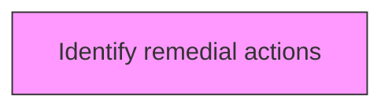
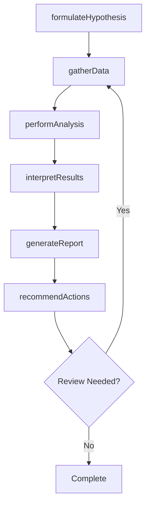

# Identify remedial actions

> Business-as-Code definition for identify remedial actions. Models the process of determining the steps that need to be taken to correct the shortcomings.

## Overview

Determining the steps that need to be taken to correct the shortcomings.

## Process Hierarchy



## GraphDL

```yaml
identify:
  object: Remedial Actions
  actor: DataAnalyst
  result: remedialActionsResult
```

## Actions

| Action | Description |
|--------|-------------|
| formulateHypothesis | Develop analytical hypothesis for remedial actions |
| gatherData | Collect and prepare data for remedial actions |
| performAnalysis | Execute analytical methods for remedial actions |
| interpretResults | Draw conclusions from remedial actions analysis |
| generateReport | Create analytical report for remedial actions |
| recommendActions | Propose remedial actions based on remedial actions findings |

## Events

| Event | Description |
|-------|-------------|
| hypothesisFormulated | Analytical hypothesis developed |
| dataGathered | Data collected and prepared for analysis |
| analysisPerformed | Analytical methods executed |
| resultsInterpreted | Conclusions drawn from analysis |
| reportGenerated | Analytical report created |
| actionsRecommended | Remedial actions proposed based on findings |

## Searches

| Search | Description |
|--------|-------------|
| findRemedialActions | Retrieve remedial actions records filtered by status, date, or scope |
| getRemedialActionsDetails | Get detailed information for a specific remedial actions record |
| listRemedialActionsHistory | Query the history of changes and updates to remedial actions |
| getActiveItems | List currently active items related to remedial actions |

## Process Flow



## RACI Matrix

| Activity | Responsible | Accountable | Consulted | Informed |
|----------|-------------|-------------|-----------|----------|
| formulateHypothesis | DataAnalyst | AnalyticsManager | BusinessStakeholders | Stakeholders |
| gatherData | DataScientist | AnalyticsManager | ITDataEngineering | Stakeholders |
| performAnalysis | AnalyticsManager | ChiefDataOfficer | Strategy | Stakeholders |
| interpretResults | DataAnalyst | AnalyticsManager | Operations | Stakeholders |

## Related Processes

| Process | Relationship |
|---------|-------------|
| 13.8.1 Develop and manage hypotheses | Upstream - hypotheses drive data collection |
| 13.8.2 Collect data | Parallel - data collection supports analysis |
| 13.8.3 Analyze data | Downstream - analysis produces actionable insights |

## Related Departments

| Department | Role |
|-----------|------|
| Analytics | Primary owner of enterprise analytics delivery |
| IT | Provides data infrastructure and analytics platforms |
| Operations | Consumes analytics outputs for operational decisions |
| Strategy | Uses analytics insights for strategic planning |

## Related Occupations

| Occupation | Involvement |
|-----------|-------------|
| Data Analyst | Performs data analysis and reporting |
| Analytics Manager | Leads analytics programs and team delivery |
| Data Scientist | Develops advanced analytical models and hypotheses |

## KPIs

| KPI | Description | Unit |
|-----|-------------|------|
| Insight Adoption Rate | Percentage of analytical insights acted upon by stakeholders | % |
| Data Quality Score | Accuracy and completeness of data used in analysis | Score (1-100) |
| Analysis Cycle Time | Average time from hypothesis to delivered insight | Days |
| Report Utilization | Percentage of published reports actively viewed by recipients | % |

## Usage

```typescript
import { identifyRemedialActions } from '@headlessly/identify-remedial-actions'

const client = identifyRemedialActions()

// Develop analytical hypothesis for remedial actions
const result = await client.formulateHypothesis({
  scope: 'enterprise',
  period: 'Q1-2025'
})

// Collect and prepare data for remedial actions
const assessment = await client.gatherData({
  resultId: result.id,
  criteria: 'standard'
})

// Execute analytical methods for remedial actions
await client.performAnalysis({
  resultId: result.id,
  format: 'detailed',
  recipients: ['stakeholders']
})
```
