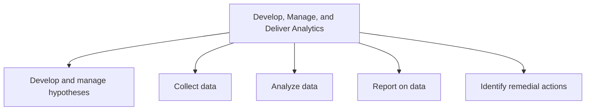
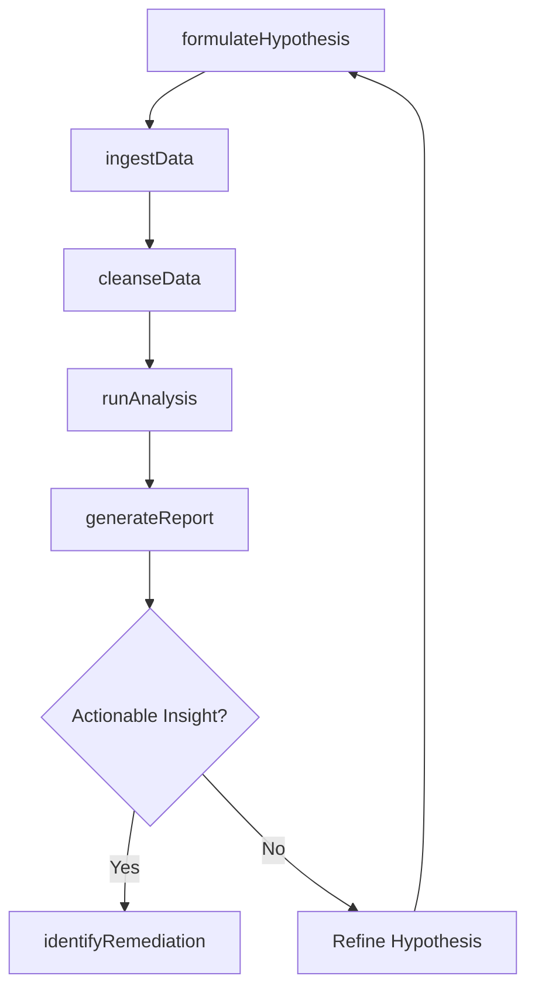

# Develop, Manage, and Deliver Analytics

> Business-as-Code definition for enterprise analytics capability. Models the end-to-end analytics lifecycle from hypothesis formulation and data collection through statistical analysis, reporting, and remedial action identification.

## Overview

Creating new and improving existing analytical capabilities to enhance data management pipeline.

## Process Hierarchy



## GraphDL

```yaml
develop,:
  object: Manage, And Deliver Analytics
  actor: DataAnalyticsManager
  result: AnalyticsInsightReport
```

## Actions

| Action | Description |
|--------|-------------|
| formulateHypothesis | Define a testable business hypothesis with expected outcomes |
| ingestData | Collect and integrate structured and unstructured data from source systems |
| cleanseData | Validate, deduplicate, and transform raw data for analysis |
| runAnalysis | Apply statistical algorithms and models to prepared datasets |
| generateReport | Create visualizations and narrative summaries of analytical findings |
| identifyRemediation | Determine corrective actions based on analytical insights |

## Events

| Event | Description |
|-------|-------------|
| hypothesisFormulated | Business hypothesis defined and analysis plan established |
| dataIngested | Data collected from source systems and staged for processing |
| dataCleansed | Raw data validated, transformed, and ready for analysis |
| analysisCompleted | Statistical analysis executed and results generated |
| reportGenerated | Analytical report with visualizations published to stakeholders |
| remediationIdentified | Corrective actions determined from analytical findings |

## Searches

| Search | Description |
|--------|-------------|
| findDatasets | List available datasets filtered by source, domain, or freshness |
| getAnalysisResults | Retrieve results of a completed analysis by hypothesis or project |
| findReports | Search published analytics reports by topic, author, or date |
| getDataQualityMetrics | Retrieve data quality scores for ingested datasets |

## Process Flow



## RACI Matrix

| Activity | Responsible | Accountable | Consulted | Informed |
|----------|-------------|-------------|-----------|----------|
| formulateHypothesis | DataScientist | AnalyticsManager | BusinessStakeholder | Executive |
| ingestData | DataEngineer | AnalyticsManager | IT | DataGovernance |
| runAnalysis | DataScientist | AnalyticsManager | DomainExpert | ProductOwner |
| generateReport | DataAnalyst | AnalyticsManager | Communications | SteeringCommittee |
| identifyRemediation | AnalyticsManager | VP Operations | ProcessOwners | Executive |

## Sub-Processes

| ID | Name | Description |
|----|------|-------------|
| 13.8.1 | Develop and manage hypotheses | Creating theories that explain empirical data. Use the hypotheses to guide feature selection in the  |
| 13.8.2 | Collect data | Gathering and harvesting structured and unstructured data from disparate sources. Clean and pre-proc |
| 13.8.3 | Analyze data | Conducting data analysis. Choose statistical algorithms that best reveal patterns and trends in the  |
| 13.8.4 | Report on data | Summarizing and documenting the results of data analysis. Create graphs and visualizations to illust |
| 13.8.5 | Identify remedial actions | Determining the steps that need to be taken to correct the shortcomings. |

## Related Processes

| Process | Relationship |
|---------|-------------|
| 13.6 Measure and benchmark | Upstream - performance measurement data feeds analytics |
| 13.5 Develop and manage enterprise-wide KM capability | Downstream - analytical insights enrich the knowledge base |
| 13.1 Manage business processes | Parallel - process data is a key analytics input |
| 7.3 Manage information technology | Enabling - IT provides data infrastructure and platforms |

## Related Departments

| Department | Role |
|-----------|------|
| Data and Analytics | Primary owner of analytics strategy, tools, and delivery |
| Information Technology | Provides data infrastructure, pipelines, and platform support |
| Business Intelligence | Develops dashboards and self-service reporting tools |
| Operations | Key consumer of operational analytics and insights |
| Finance | Uses analytics for forecasting and financial planning |

## Related Occupations

| Occupation | Involvement |
|-----------|-------------|
| Data Scientist | Formulates hypotheses and builds predictive models |
| Data Engineer | Designs data pipelines and manages data integration |
| Data Analyst | Prepares reports and visualizations for business stakeholders |
| Analytics Manager | Governs the analytics program and prioritizes workstreams |

## KPIs

| KPI | Description | Unit |
|-----|-------------|------|
| Insight Adoption Rate | Percentage of analytical recommendations acted upon by business | % |
| Data Pipeline Freshness | Lag between source system update and data availability for analysis | Hours |
| Model Accuracy | Predictive model accuracy measured by appropriate statistical metric | % |
| Report Delivery Timeliness | Percentage of reports delivered by their scheduled deadline | % |
| Data Quality Score | Composite score reflecting completeness, accuracy, and consistency of data | Score (1-100) |

## Usage

```typescript
import { developManageAndDeliverAnalytics } from '@headlessly/develop-manage-and-deliver-analytics'

const analytics = developManageAndDeliverAnalytics()

// Formulate a hypothesis about customer churn
const hypothesis = await analytics.formulateHypothesis({
  domain: 'customer-retention',
  statement: 'Customers with fewer than 3 support interactions in 90 days have higher churn',
  expectedOutcome: 'churn-rate-correlation'
})

// Run analysis on the prepared dataset
const results = await analytics.runAnalysis({
  hypothesisId: hypothesis.id,
  algorithm: 'logistic-regression',
  datasetId: 'DS-2026-CRM-Q1'
})
```
