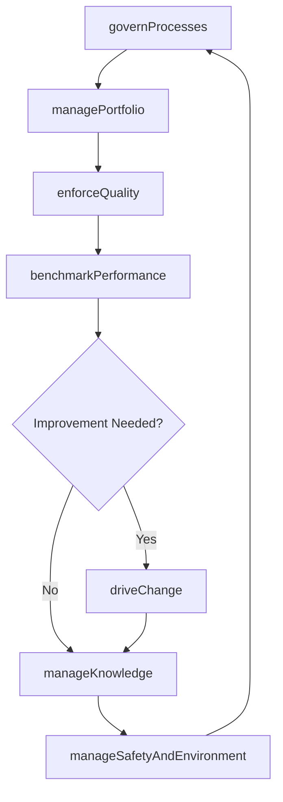

# Develop and Manage Business Capabilities

> Business-as-Code definition for building and governing foundational organizational capabilities including process management, portfolio and project management, quality assurance, change management, knowledge management, benchmarking, and environmental health and safety.

## Overview

Performing activities by an organization that are fundamental to the successful operation of the organization, even across functions in a business. Capabilities defined in the PCF include business process management; portfolio, program, and project management; quality management; change management; benchmarking; environmental health and safety management; and knowledge management.

## Process Hierarchy

```mermaid
graph TD
    A[Develop and Manage Business Capabilities]
    A --> B[Manage business processes]
    A --> C[Manage portfolio, program, and project]
    A --> D[Manage enterprise quality]
    A --> E[Manage change]
    A --> F[Develop and manage enterprise-wide knowledge management (KM) capability]
    A --> G[Measure and benchmark]
    A --> H[Manage environmental health and safety (EHS)]
    A --> I[Develop, Manage, and Deliver Analytics]
```

## GraphDL

```yaml
develop:
  object: And Manage Business Capabilities
  actor: ChiefOperatingOfficer
  result: BusinessCapabilityPortfolio
```

## Actions

| Action | Description |
|--------|-------------|
| governProcesses | Establish and maintain governance frameworks for business process management |
| managePortfolio | Oversee the portfolio of programs and projects across the enterprise |
| enforceQuality | Define quality standards and ensure organizational adherence |
| driveChange | Plan, design, and implement organizational change initiatives |
| manageKnowledge | Develop enterprise-wide knowledge capture, sharing, and reuse capabilities |
| benchmarkPerformance | Measure and compare organizational performance against peers and standards |
| manageSafetyAndEnvironment | Administer environmental health and safety programs and compliance |

## Events

| Event | Description |
|-------|-------------|
| processesGoverned | Process governance framework established or updated |
| portfolioManaged | Portfolio review cycle completed with prioritization decisions |
| qualityEnforced | Quality standards audit or certification completed |
| changeDriven | Organizational change initiative implemented |
| knowledgeManaged | Knowledge base updated or knowledge sharing session conducted |
| performanceBenchmarked | Benchmarking study completed with peer comparisons |
| safetyAndEnvironmentManaged | EHS compliance review or program update completed |

## Searches

| Search | Description |
|--------|-------------|
| findCapabilities | List business capabilities by maturity level, domain, or owner |
| getProjectPortfolio | Retrieve active projects filtered by program, status, or budget |
| getQualityMetrics | Query quality performance indicators by process area |
| findChangeInitiatives | List active change management initiatives by phase or business unit |
| getBenchmarkResults | Retrieve benchmarking studies and comparative performance data |
| getEHSIncidents | Query environmental health and safety incidents by type or severity |

## Process Flow



## RACI Matrix

| Activity | Responsible | Accountable | Consulted | Informed |
|----------|-------------|-------------|-----------|----------|
| governProcesses | ProcessExcellenceLead | COO | BusinessUnitLeads | IT |
| managePortfolio | PMODirector | CFO | ProjectManagers | ExecutiveTeam |
| enforceQuality | QualityManager | VP Operations | ProcessOwners | Compliance |
| driveChange | ChangeManager | COO | HumanResources | AllStaff |
| benchmarkPerformance | PerformanceAnalyst | COO | Finance | Board |

## Sub-Processes

| ID | Name | Description |
|----|------|-------------|
| 13.1 | Manage business processes | Establishing and administering governance for management of the processes. Outline and manage the fr |
| 13.2 | Manage portfolio, program, and project | Managing investments, holdings, products, businesses, and brands, along with the related projects th |
| 13.3 | Manage enterprise quality | Managing organizational attributes that are closely associated with the quality of output. Determine |
| 13.4 | Manage change | Planning, designing, and implementing the change. Ensure improvement in the change process. |
| 13.5 | Develop and manage enterprise-wide knowledge management (KM) capability | Creating and administering the capability of the organization's knowledge management function. Devel |
| 13.6 | Measure and benchmark | Creating and administering a strategy to manage organizational performance. Benchmark the performanc |
| 13.7 | Manage environmental health and safety (EHS) | Determining the impacts of environmental health and safety. Create and implement the EHS program. Tr |
| 13.8 | Develop, Manage, and Deliver Analytics | Creating new and improving existing analytical capabilities to enhance data management pipeline. |

## Related Processes

| Process | Relationship |
|---------|-------------|
| 1.0 Develop Vision and Strategy | Upstream - strategic goals drive capability investments |
| 11.0 Manage Enterprise Risk, Compliance, Remediation, and Resiliency | Parallel - risk and compliance inform quality and EHS programs |
| 7.0 Manage Information Technology | Parallel - IT capabilities support process automation and analytics |
| 9.0 Acquire and Manage Human Capital | Parallel - workforce development enables organizational capabilities |

## Related Departments

| Department | Role |
|-----------|------|
| Process Excellence | Owns process governance, modeling, and continuous improvement |
| Project Management Office | Manages enterprise portfolio, program, and project delivery |
| Quality Assurance | Defines and enforces quality standards and certifications |
| Organizational Development | Drives change management and capability building |
| Environmental Health and Safety | Administers EHS compliance programs and incident management |

## Related Occupations

| Occupation | Involvement |
|-----------|-------------|
| Business Process Analyst | Models, documents, and optimizes business processes |
| Program Manager | Coordinates cross-functional programs and project portfolios |
| Quality Engineer | Implements quality standards and performs audits |
| Change Management Consultant | Designs and facilitates organizational change adoption |

## KPIs

| KPI | Description | Unit |
|-----|-------------|------|
| Process Maturity Score | Average capability maturity level across documented processes | Level (1-5) |
| Project Success Rate | Percentage of projects delivered on time, on budget, and in scope | % |
| Quality Defect Rate | Number of quality defects per thousand units of output | Per 1000 |
| Change Adoption Rate | Percentage of employees successfully adopting planned changes | % |
| EHS Incident Rate | Recordable incidents per 200,000 work hours | Rate |

## Usage

```typescript
import { developAndManageBusinessCapabilities } from '@headlessly/develop-and-manage-business-capabilities'

const capabilities = developAndManageBusinessCapabilities()

// Assess process maturity across the organization
const maturity = await capabilities.governProcesses({
  scope: 'enterprise',
  framework: 'CMMI',
  assessmentDepth: 'detailed'
})

// Query active project portfolio
const portfolio = await capabilities.getProjectPortfolio({
  status: 'active',
  minBudget: 100000,
  program: 'digital-transformation'
})

// Benchmark against industry peers
const benchmark = await capabilities.benchmarkPerformance({
  industry: 'manufacturing',
  metrics: ['cycle-time', 'defect-rate', 'cost-per-unit'],
  peerGroup: 'top-quartile'
})
```
