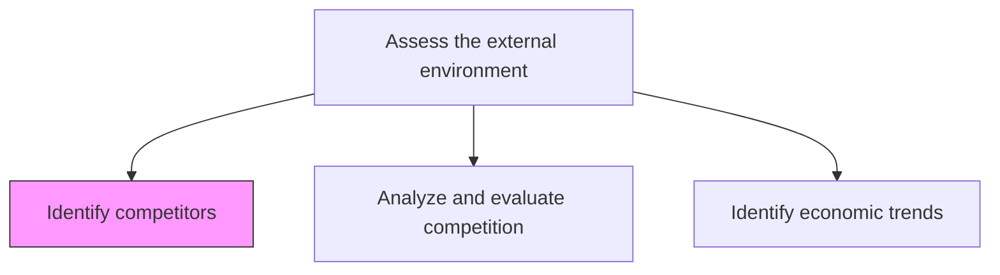
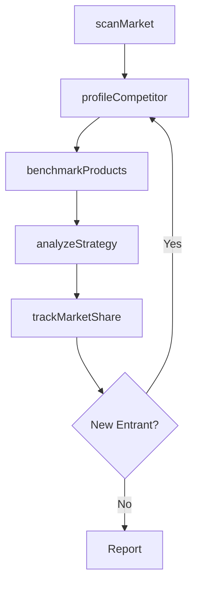

# Processes Business-as-Code

This folder contains MDX definitions for ~2,000 APQC cross-industry business processes modeled as Business-as-Code APIs.

## Your Task

When assigned a process file, fill in the TODO sections following the template below. Each process should be a complete, programmable API definition.

## Template Reference

Use this example as your model:

```mdx
---
name: 'Identify competitors'
code: '19945'
hierarchyId: '1.1.1.1'
category: 'Develop Vision and Strategy'
processGroup: 'Define the business concept and long-term vision'
level: Activity
verb: 'Identify'
object: 'Competitors'
metricsAvailable: false
parent: '1.1.1'
---

# Identify competitors

> Business-as-Code definition for competitive intelligence gathering. Models the complete process of identifying, tracking, and analyzing competitors.

## Overview

Identifying your competitors, their service and/or product. Evaluating competitors strategies to determine their strengths and weaknesses relative to those of your own product or service.

## Process Hierarchy



## GraphDL

```yaml
identify:
  object: Competitors
  actor: StrategyAnalyst
  result: CompetitorProfile
```

## Actions

| Action | Description |
|--------|-------------|
| scanMarket | Survey the market landscape for competing firms |
| profileCompetitor | Create detailed profile of a competitor's capabilities |
| benchmarkProducts | Compare competitor products against own offerings |
| trackMarketShare | Monitor competitor market share changes |
| analyzeStrategy | Evaluate competitor strategic positioning |

## Events

| Event | Description |
|-------|-------------|
| marketScanned | Market landscape survey completed |
| competitorProfiled | Competitor profile created or updated |
| productsBenchmarked | Product comparison analysis completed |
| marketShareTracked | Market share data updated |
| strategyAnalyzed | Competitor strategy evaluation completed |

## Searches

| Search | Description |
|--------|-------------|
| findCompetitors | List competitors filtered by market, size, or geography |
| getCompetitorProfile | Retrieve detailed profile for a specific competitor |
| getBenchmarks | Get product benchmark comparisons |
| getMarketShareTrends | Retrieve market share data over time |

## Process Flow



## RACI Matrix

| Activity | Responsible | Accountable | Consulted | Informed |
|----------|-------------|-------------|-----------|----------|
| scanMarket | StrategyAnalyst | VP Strategy | SalesTeam | Executive |
| profileCompetitor | StrategyAnalyst | VP Strategy | ProductTeam | Marketing |
| benchmarkProducts | ProductAnalyst | VP Product | Engineering | Sales |
| trackMarketShare | MarketResearcher | VP Strategy | Finance | Board |

## Related Processes

| Process | Relationship |
|---------|-------------|
| 1.1.1.2 Analyze and evaluate competition | Downstream - uses competitor data |
| 1.1.2 Survey market and determine customer needs | Parallel - market intelligence |
| 1.2.2 Define and evaluate strategic options | Consumer - informs strategy |

## Related Departments

| Department | Role |
|-----------|------|
| Strategy | Primary owner of competitive intelligence |
| Marketing | Contributes market positioning insights |
| Sales | Provides front-line competitive encounters |
| Product | Uses benchmarks for product decisions |

## Related Occupations

| Occupation | Involvement |
|-----------|-------------|
| Strategy Analyst | Primary executor |
| Market Researcher | Data collection |
| Business Intelligence Analyst | Data analysis |

## KPIs

| KPI | Description | Unit |
|-----|-------------|------|
| Competitor Coverage | Percentage of known competitors profiled | % |
| Intelligence Freshness | Average age of competitor profiles | Days |
| Benchmark Frequency | How often benchmarks are updated | Per Quarter |

## Usage

```typescript
import { identifyCompetitors } from '@headlessly/identify-competitors'

const intel = identifyCompetitors()

// Scan market for competitors
const competitors = await intel.scanMarket({
  industry: 'SaaS',
  region: 'North America',
  minRevenue: 1000000
})

// Profile a specific competitor
const profile = await intel.profileCompetitor({
  competitorId: competitors[0].id,
  depth: 'comprehensive'
})
```
```

## Key Guidelines

1. **Actions** = Functions the process can execute (camelCase verbs)
2. **Events** = Past-tense outcomes that trigger automation (camelCase)
3. **Searches** = Query functions to retrieve data (camelCase)
4. **GraphDL** = Semantic verb-object-actor-result definition
5. **RACI** = Responsibility assignment for sub-activities
6. **KPIs** = Measurable outcomes with units

## Verb/Object Rules

The `verb` and `object` frontmatter fields are extracted from the process name:
- First word = verb, remainder (dropping "the/a/an") = object
- "Identify competitors" -> verb: `Identify`, object: `Competitors`
- "Assess the external environment" -> verb: `Assess`, object: `External Environment`
- "Develop Vision and Strategy" -> verb: `Develop`, object: `Vision And Strategy`
- Keep in **Title Case** to preserve acronyms (IT, HR, EHS, M&A, etc.)

## Package Naming

The `verb` and `object` generate the package name:
- verb: `Identify`, object: `Competitors` -> `@headlessly/identify-competitors`
- verb: `Develop`, object: `Vision And Strategy` -> `@headlessly/develop-vision-and-strategy`

## Workflow & Process Diagrams

- Use Mermaid `graph TD` for sequential workflows
- Use Mermaid `graph LR` for actor relationship maps
- Keep diagrams focused on the 5-10 most important steps/relationships

## DO NOT

- Do not invent placeholder data - use realistic business process terms
- Do not add sections not in the template
- Do not change the frontmatter structure
- Do not include the word "API" in headings
- Do not use emoji
- Do not change the hierarchy ID, code, or parent fields

## Source Data

APQC PCF v7.4 cross-industry process data. Curated data is in `_curation/` with separate TSVs for:
- `categories.tsv` - 13 top-level process categories
- `process-groups.tsv` - 85 process groups
- `processes.tsv` - 353 processes
- `activities.tsv` - ~1,367 activities
- `tasks.tsv` - ~192 tasks
